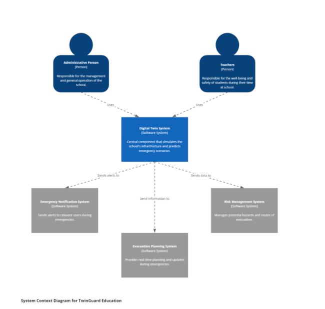
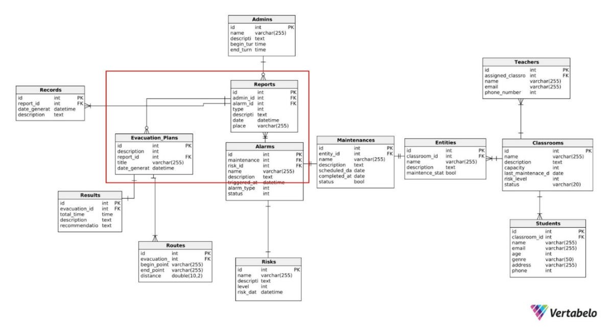
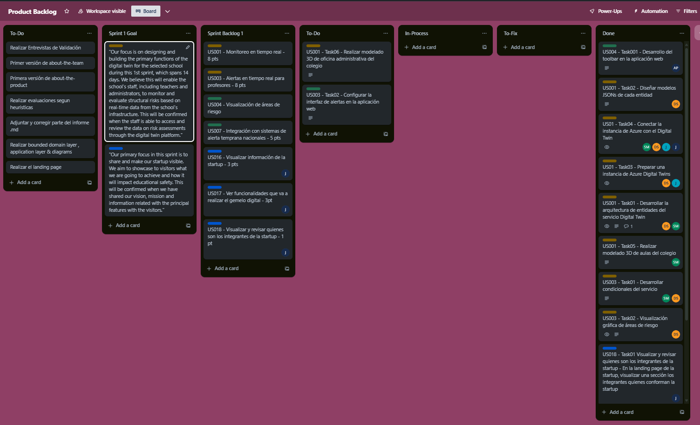

<h1 align="center"> Universidad Peruana de Ciencias Aplicadas
  (UPC) 
Ingeniería de Software – Grupo 1
</h1>
 
<h2 align="center">
  Trabajo Final del Curso – TB2  
  Startup:
    
  Producto:
    
   
   
  Integrantes:
   
   
  Florentino Josue, Carrasco Hernández – u202020727 
  Mendoza Barco, Saúl Enrique – u20211c677 
  Navarro Chacon, Juan Jose - u20201f316  
  Patazca Calderón, Santos Alexis - u202021C269 
  Sánchez Ramírez, Diego Antonio - u202021367 
   
   
   
  
  Septiembre, 2024
  
</h2>
  
# Registro de Versiones

| Versión | Fecha | Autor | Descripción de modificación |
| ----------- | ---------- | --------------- | ---------------------------------------------|
| TB1         |            | Sánchez Ramírez, Diego Antonio | Se realiza el análisis y la recopilación de datos para profundizar en la problematica elegida. |
| TB2         |            | Sánchez Ramírez, Diego Antonio | Se realiza el prototipo del servicio, cliente-servidor y la aplicación web, ademas de presentar un landing page para presentar información relevante de la startup |
---

# ABET – EAC - Student Outcome 3

<strong>Criterio:</strong> Capacidad de comunicarse efectivamente con un rango de audiencias.
En el siguiente cuadro se describe las acciones realizadas y enunciados de
conclusiones por parte del grupo, que permiten sustentar el haber alcanzado el logro
del <strong>ABET – EAC - Student Outcome 3</strong>.

|Criterio específico|Acciones realizadas|Conclusiones|
| -------------------- | --------------------------------- | ---------------------------------|
| Comunica oralmente sus ideas y/o resultados con objetividad a público de diferentes especialidades y niveles jerárquicos, en el marco del desarrollo de un proyecto en ingeniería.|**TB1  Carrasco Hernández, Florentino Josué** - Utilicé sesiones de story mapping para visualizar y priorizar las necesidades del producto, facilitando workshops donde cada disciplina pueda aportar desde su especialización. **Patazca Calderón, Santos Alexis** - En este primer entregable, se definieron todos los puntos necesarios, para eso realizamos entrevistas y también implementamos los diagramas.  **Sánchez Ramírez, Diego Antonio**- Realicé entrevistas para luego sintetizar en un needfinding, desarrollando un lenguaje para que los segmentos objetivos puedan comprender la solución brindada.   **Saúl Enrique Mendoza Barco** - Realicé investigación para el análisis de competidores, comparando fortalezas y debilidades para realizar un producto eficiente que satisfaga las expectativas del público objetivo. **Navarro Chacon, Juan Jose** - Realicé el estudio de los Lean UX Problem Statements y Lean UX Assumptions, lo que dio un mayor conocimiento del funcionamiento de los user outcomes y de los business outcomes. **TP** **Navarro Chacon, Juan Jose** - Presenté el desarrollo del wireframe y mockup de la aplicación móvil, explicando su propósito y funcionalidad. Mostré las pantallas clave y recibí retroalimentación del público, lo que me permitió realizar ajustes para que las ideas fueran comprensibles para todos. **TB2** **Saúl Enrique Mendoza Barco** -  En el desarrollo del proyecto, comuniqué de manera objetiva los resultados y avances del modelado del digital twin de un salón de clases, explicando cómo este modelo simula situaciones de emergencia para facilitar la planificación de evacuaciones. También presenté la documentación de diversos aspectos del proyecto, asegurando que los detalles técnicos fueran accesibles y comprensibles para audiencias de distintas especialidades y niveles jerárquicos, promoviendo así una comunicación efectiva y alineada con los objetivos del equipo. **Navarro Chacon, Juan Jose** - Presenté la landing page de la aplicación y expliqué cómo su diseño orienta al usuario hacia las funciones principales. Recibí retroalimentación y realicé ajustes para una mejor comprensión del diseño en todos los niveles de audiencia. **Patazca Calderón, Santos Alexis** - Realice un avance el forntend de la pagina web de nuestro proyecto, para que el usuario pueda comprender la funcionalidad. También he ido desarrollando algunas mejoras en el documento, para seguir comprendiendo los objetivos de nuestro proyecto.  **Carrasco Hernández, Florentino Josué** - Realicé una presentación inicial para explicar la arquitectura de conexión de instancias en C# a los integrantes del equipo, que incluía desarrolladores de diversas especialidades . **Sánchez Ramírez, Diego Antonio** -Realicé junto con mis compañeros el desarrollo y el despliegue de los servicios de Azure, que son Digital Twin instance y su almacenamiento. Además, profundizamos en equipo los conceptos que debemos de saber antes de utilizar el CLI e interfaces del 3D Studio y TwinGraph | **TB1:**  Se refleja un enfoque integral en la definición y desarrollo del producto, destacando la importancia de la colaboración multidisciplinaria, la comunicación efectiva, el análisis competitivo y el conocimiento profundo del usuario para lograr una solución eficiente y satisfactoria, adaptando el proyecto a las necesidades del segmento. **TB2:**  La comunicación oral efectiva y el entendimiento de la audiencia permiten exponer resultados técnicos de manera clara, facilitando el proceso de retroalimentación y ajuste continuo en el diseño y ejecución del proyecto.| 
|Comunica en forma escrita ideas y/o resultados con objetividad a público de diferentes especialidades y niveles jerárquicos, en el marco del desarrollo de un proyecto en ingeniería.|**TB1** **Patazca Calderón, Santos Alexis** - Se desarrolló el empathy mapping que nos ayudó a comprender nuestros segmentos objetivos y también los diagramas C4. **Carrasco Hernández, Florentino** - Identifiqué las user stories del proyecto e identifiqué las oportunidades y amenazas dentro del sector que podrían impactar el desarrollo y lanzamiento del software. **Sánchez Ramírez, Diego Antonio** - Analicé las fases de cada segmento objetivo antes y durante el uso del sistema, evaluando sus pensamientos, sentimientos y preocupaciones. **Saúl Enrique Mendoza Barco** - Identifiqué a los competidores potenciales, analizando sus estrategias para diferenciar nuestro producto y alcanzar al público objetivo. **Navarro Chacon, Juan Jose** - Identifiqué los principales drivers a través de la búsqueda de user stories, priorizando los esenciales para el desarrollo del proyecto.  **TP** **Navarro Chacon, Juan Jose** - Documenté el proceso de creación del wireframe y mockup, incluyendo un resumen del proyecto, la metodología y gráficos de los diseños, explicando su funcionalidad y reflexionando sobre la importancia de estos elementos para la claridad a distintos niveles. **TB2** **Saúl Enrique Mendoza Barco** - En el desarrollo del proyecto, documenté de forma escrita y objetiva los resultados y avances del modelado del digital twin de un salón de clases, detallando cómo este modelo permite simular situaciones de emergencia para mejorar la planificación de evacuaciones. La documentación fue estructurada para ser accesible a audiencias de diferentes especialidades y niveles jerárquicos, asegurando claridad en los aspectos técnicos y promoviendo una comprensión integral de los objetivos y beneficios del proyecto. **Navarro Chacon, Juan Jose** - Documenté el desarrollo de la landing page, incluyendo su propósito, objetivos de diseño y capturas de pantalla explicativas. Describí cada sección y reflexioné sobre su importancia como primer punto de interacción con el usuario, asegurando claridad para todos los niveles y áreas involucradas.  **Patazca Calderón, Santos Alexis** - Realice algunas mejoras que logré identificar en el documento para poder cumplir con los objetivos establecidos. También desarollé una parte del frontend que servirá de apoyo para nuestro proyecto. **Carrasco Hernández, Florentino Josué** - Se documento el programa para poder unir las instancias del gemelo digital hecho en C# para poder escribir aplicaciones cliente que interactúen con la instancia del servicio Azure Digital Twins. **Sánchez Ramírez, Diego Antonio** - Se guardo la documentación relacionada al despliegue y utilización del recurso del gemelo digital para un prototipo de lo que vamos a realizar en un futuro.| **TB1:**  El desarrollo del proyecto se ha enriquecido con metodologías para entender los segmentos objetivos, definir user stories y analizar el contexto del sector, identificando necesidades y expectativas de los usuarios. **TB2:**  La documentación escrita organizada y objetiva facilita la claridad técnica para audiencias variadas, permitiendo un enfoque alineado a los objetivos del proyecto y proporcionando información valiosa para la implementación futura en entornos educativos. |

---

# Capítulo I: Introducción

## 1.1. Startup Profile

### 1.1.1. Descripción de la Startup

En, nos enfocamos en la creación de soluciones tecnológicas avanzadas, como gemelos digitales, que nos permiten simular, analizar y optimizar procesos en el sector educativo. Nuestra meta es transformar la forma en que las instituciones educativas abordan desafíos, mejorando la seguridad, la eficiencia operativa y la experiencia de los estudiantes.

**Misión**

Nuestra misión es brindar servicios de alta calidad a la sociedad, utilizando las últimas tecnologías emergentes para generar un impacto positivo y duradero.

**Visión**

Aspiramos a convertirnos en la startup insignia en la resolución de problemas sociales, aprovechando las capacidades de las tecnologías emergentes, en este caso, la tecnología de los gemelos digitales, para transformar los sectores que más lo necesitan.

### 1.1.2. Perfiles de integrantes del equipo

| Sánchez Ramírez, Diego Antonio – u202021367 |  |
|----------|----------|
|Soy un estudiante de la carrera de Ing. De Software en la Universidad de Ciencias Aplicadas (UPC). Estoy familiarizado con los lenguajes de programación C + + y HTML5, CSS y JS. Estoy en vías de aprender otros lenguajes para ser un ingeniero flexible a cualquier necesidad o problema que se presente.| |
|||

| Florentino Josue, Carrasco Hernández – u202020727 |  |
|----------|----------|
|Estudiante de Ingeniería de Software en la Universidad Peruana de Ciencias Aplicadas. Responsable, proactivo, comunicativo, tolerante, empático y orientado a resultados. Tengo conocimientos en desarrollo web HTML, CSS, JavaScript.| |
|||

| Patazca Calderón, Santos Alexis - u202021C269 |  |
|----------|----------|
|Estudiante  de la carrera de Ingeniería de Software. Me considero una persona proactiva con pensamiento estratégico, con habilidades en el ámbito de la programación y un gran espíritu investigador. Para este proyecto puedo aportar parte de mi conocimiento adquirido en el curso. Además, de las habilidades blandas tales como el trabajo en equipo, comunicación, entre otras.| |
|||

| Navarro Chacon, Juan Jose - u20201f316   |  |
|----------|----------|
|Soy estudiante de la carrera Ingeniería de Software, actualmente estoy cursando el 8vo ciclo. Me considero una persona divertida, empática, responsable, creativa, honesta y sobre todo organizada en los planes que deseo realizar. Para el trabajo que vamos a realizar puedo aportar con el desarrollo del sistema, ya que tengo conocimientos ciertos lenguajes, además de ser responsable.| |
|||

| Mendoza Barco, Saúl Enrique –  u20211c677  |  |
|----------|----------|
|Soy estudiante de Ingeniería de Software de la UPC, valoro enormemente la colaboración en equipo como un pilar fundamental en el éxito de cualquier proyecto. Mi enfoque en el trabajo en equipo se basa en la comunicación abierta y la capacidad de escuchar activamente las ideas y perspectivas de mis compañeros. Reconozco que la diversidad de opiniones y habilidades en un equipo es clave para encontrar soluciones creativas y efectivas a los desafíos que enfrentamos en el desarrollo de software.| |
|||

## 1.2. Solution Profile

### 1.2.1 Antecedentes y problemática

|Pregunta| |
| -------------- | ------------------------------------------------------------------------- |
| **What (Qué): ¿Cuál es el problema?** | El problema aparece cuando se requiere que cada institución educativa necesita trazar un plan de simulacro ante cualquier sismo para que su personal y estudiantes esten preparados para reaccionar ante estos. Un ejemplo de que tan importante es esto seria las acciones que realizan instituciones nacionales como MINAM e INDECI: que serian realizar simulacros nacionales en todo el país. Sin embargo, en muchos colegios no se presentan una infraestructura eficiente o un personal calificado para realizar planes optimos de evacuación|
| **When (Cuándo): ¿Cuándo sucede el problema?** | La problemática ocurre cuando las instituciones educativas, como los colegios, requieren planificar una ruta segura de evacuación ante una futuro acontecimiento de un sismo de una magnitud significante que pondría en riesgo a los estudiantes y al personal del colegio. Según el Instituto Geofísico del Perú (CENSIS, 2024), en el último mes, el cuál fue julio, se han registrado más de 70 sismo en todo el país, destacando el que ocurrió en el 542 km al Sur de Tacna, de magnitud 7,1 en la escala de Richter el día 18 de julio. |
| **Where (dónde): ¿Dónde está el cliente cuando usa el servicio?** | El cliente se encontrará en la oficina de dirección del Colegio, donde a traves nuestra solución podrá monitorear el estado de la infraestructura del colegio y la ruta optima para la evacuación del personal y de los estudiantes |
| **Why (por qué): ¿Cuál es la causa del problema?**|El problema ocurre debido a que el Perú se encuentra ubicado en una región sísmica muy activa llamada Cinturón de Fuego del Pacífico. Según Ayala (2022), “se trata de una larga cadena tectónica de 40 mil kilómetros, ubicada en el Océano Pacífico, que tiene forma de herradura y se caracteriza por tener una gran actividad sísmica y volcánica. En el Cinturón de Fuego del Pacífico ocurre el 90 por ciento de la actividad sísmica del planeta y concentra a la gran mayoría de volcanes activos del mundo (75 %), de ahí que el nombre de esta placa lleve la palabra fuego”. Por lo tanto, la probabilidad de que ocurra un sismo en territorio peruano es elevada, lo que afectaría la seguridad de los estudiantes y el personal de los colegios. |
| **Who (quién): ¿Quiénes están involucrados?** | Estudiantes, personal educativo y administrativo que desean contar con un sistema para la prevención de accidentes en un colegio y que cuente con una excelente gestión de riesgos. Mejorando la respuesta ante situaciones de emergencia. |

 

|Pregunta| |
| -------------- | ------------------------------------------------------------------------- |
| How (cómo):¿En qué condiciones los clientes usan nuestro producto? | En cuestión para conseguir trazar una ruta o plan de evacuación ante algun sismo que se presenta en horarios de clases |
| ¿Qué llevó a la persona a llegar a nuestro servicio? | Segun el nuevo reglamento promulgado por la Minedu (29 de febrero del 2021), dicta que los colegios, tanto publicos como privados deben contador con una infraestructura que este acorde a los parámetros seguridad, funcionalidad, habitalidad y accesibilidad establecidas en la normativa vigente. Esto incluye, servicios complementarios que puedan garantizar la seguridad y bienestar de los estudiantes, por esta razón nuestro servicio será prioritario para asegurar estos aspectos. |
| How much (cuánto) ¿Cuánta es la demanda de la problemática? | Según una nota de prensa de la MINEDU : "En los últimos 15 años, la oferta de colegios privados creció en un 39% a nivel nacional, al pasar de 10,400 en 2006 a 13,500 en 2020 (MINEDU, 3 de Marzo del 2021). Este dato refleja la clara demanda que existe en la seguridad de los estudiantes en los colegios privados o publicos. |

### 1.2.2 Lean UX Process

#### 1.2.2.1 Lean UX Problem Statements

Las escuelas en Perú, como la John F. Kennedy en La Perla, Callao, enfrentan serios desafíos de seguridad debido a la antigüedad de sus infraestructuras, muchas de las cuales tienen más de 50 años. Estas instituciones, ubicadas en zonas urbanas vulnerables a sismos, carecen de herramientas avanzadas para prever y mitigar los riesgos asociados a desastres naturales, como terremotos. Esta situación pone en peligro la seguridad de estudiantes y personal educativo, quienes están expuestos a posibles daños estructurales que podrían resultar en graves consecuencias durante un evento sísmico.
El problema es especialmente crítico en un contexto donde la actividad sísmica en el país es alta; solo en el último mes, se han registrado más de 70 sismos, incluyendo uno de magnitud 7.1 en Tacna. A pesar de esta realidad, las instituciones educativas no cuentan con un sistema predictivo y preventivo eficaz que les permita anticipar situaciones peligrosas y gestionar emergencias de manera eficiente. Como resultado, la comunidad educativa vive con incertidumbre, temiendo que un sismo podría desencadenar una catástrofe debido a la falta de preparación adecuada.
La solución que proponemos es la implementación de un gemelo digital en la escuela John F. Kennedy. Este gemelo digital funcionará como una réplica virtual del entorno escolar, permitiendo simular y predecir en tiempo real situaciones peligrosas. Esto facilitará la identificación de áreas de riesgo y la optimización de rutas de evacuación, asegurando una respuesta rápida y coordinada ante emergencias. Al resolver este problema, no solo se mejorará la seguridad en la escuela, sino que se establecerá un modelo que puede ser replicado en otras instituciones educativas, contribuyendo a un entorno escolar más seguro y resiliente en todo el país.

#### 1.2.2.2 Lean UX Assumptions

#### 1.2.2.3 Lean UX Hypothesis Statements
  
#### 1.2.2.4 Lean UX  Canvas

### Segmentos objetivo

<table>
  <tr>
    <th colspan="2">Competitive Analysis Landscape</th>
  </tr>
  <tr>
    <td rowspan="2">¿Por qué llevar a cabo este análisis?</td>
    <td>¿Quiénes son nuestros principales competidores y que nos diferencia de ellos?</td>
  </tr>
  <tr>
    <td>Gracias al análisis de la competencia presente en el mercado podremos conocer las fortalezas y debilidades de nuestros principales competidores. Además, lograremos identificar las estrategias utilizadas por los competidores y su presencia dentro del mercado. A partir de la información recopilada en el análisis competitivo podremos plantear estrategias que nos permitan posicionarnos dentro del mercado.</td>
  </tr>
</table>

 

<table>
  <tr>
    <th colspan="2"></th>
    <th>
      

        TwinGuard Education
      

    </th>
    <th>
      

        Kizeo Forms
      

    </th>
    <th>
      

        SchoolSafe
      

    </th>
    <th>
      

        K12 Alert
      

    </th>
  </tr>
  <tr>
    <td rowspan="2"><strong>Perfil</strong></td>
    <td>Overview</td>
    <td>Nos especializamos en el uso de gemelos digitales para optimizar y garantizar la seguridad en infraestructuras educativas, especialmente en áreas propensas a desastres naturales. El enfoque específico en la educación, combinado con la capacidad de simular, analizar y predecir escenarios de riesgo en tiempo real, nos posiciona como líder en la creación de entornos escolares más seguros y eficientes.</td>
    <td>Kizeo Forms es una plataforma que permite digitalizar y automatizar la recopilación de datos mediante formularios personalizados. Sus soluciones están diseñadas para sectores diversos como la construcción, la agricultura, y la educación, ofreciendo una herramienta flexible que se adapta a las necesidades de los usuarios.</td>
    <td>SchoolSafe es una solución enfocada en la comunicación rápida y eficiente en situaciones de emergencia en el ámbito educativo. Ofrecen una plataforma que facilita la coordinación entre las instituciones educativas y los servicios de emergencia locales, mejorando la seguridad escolar. SchoolSafe está diseñado para asegurar que los estudiantes y el personal educativo estén preparados y bien informados en caso de cualquier incidente crítico.</td>
    <td>K12 Alerts es un sistema de notificación de emergencias específicamente dirigido a instituciones educativas, principalmente en el sector K-12. Su plataforma permite a los administradores escolares enviar alertas y mensajes masivos a padres, estudiantes y personal en caso de emergencias o situaciones críticas. Es una herramienta fácil de usar que se centra en asegurar que todos los involucrados estén informados en tiempo real, garantizando una respuesta rápida ante cualquier eventualidad.</td>
  </tr>
  <tr>
    <td>Ventaja competitiva ¿Qué valor ofrece a los clientes?</td>
    <td>Nos especializamos en el uso de gemelos digitales para optimizar y garantizar la seguridad en infraestructuras educativas, especialmente en áreas propensas a desastres naturales. El enfoque específico en la educación, combinado con la capacidad de simular, analizar y predecir escenarios de riesgo en tiempo real, nos posiciona como líder en la creación de entornos escolares más seguros y eficientes.</td>
    <td>Kizeo Forms permite a las empresas digitalizar sus formularios y flujos de trabajo, optimizando la recopilación de datos en tiempo real. Su valor radica en la personalización y la capacidad de integrarse con varios sistemas.</td>
    <td>SchoolSafe ofrece soluciones de comunicación rápida y efectiva en situaciones de emergencia en las escuelas, facilitando la coordinación entre personal educativo y servicios de emergencia.</td>
    <td>K12 Alerts ofrece una solución de notificación rápida y efectiva para emergencias en escuelas, asegurando la comunicación entre la administración, estudiantes, y padres de familia.</td>
  </tr>
  <tr>
    <td rowspan="2"><strong>Perfil Marketing</strong></td>
    <td>Mercado Objetivo</td>
    <td>Instituciones educativas, tanto públicas como privadas, en regiones con alta vulnerabilidad a desastres naturales, como terremotos. Inicialmente, el mercado objetivo está centrado en Perú, con la posibilidad de expandirse a otras regiones de América Latina y más allá.</td>
    <td>Empresas de múltiples sectores que buscan digitalizar procesos manuales, como la construcción, servicios públicos, agricultura, y otros. También es utilizado por instituciones educativas para recopilar datos sobre seguridad y operaciones.</td>
    <td>Instituciones educativas que necesitan soluciones de comunicación de emergencia para proteger a estudiantes y personal.</td>
    <td>Instituciones educativas, especialmente en K-12, que buscan mejorar su capacidad de respuesta en emergencias y notificar rápidamente a todas las partes involucradas.</td>
  </tr>
  <tr>
    <td>Estrategias de marketing</td>
    <td>Nuestra estrategia se basa en campañas de concienciación sobre la seguridad escolar y la importancia de la preparación ante desastres naturales. Establecer alianzas estratégicas con gobiernos locales y organizaciones no gubernamentales para financiar la implementación de gemelos digitales en escuelas de alto riesgo.</td>
    <td>Enfatizan los beneficios de la transformación digital en los procesos manuales, con estudios de caso y testimonios. Se centran en la optimización de tiempo y eficiencia.</td>
    <td>Sus campañas se centran en resaltar la importancia de la seguridad escolar, con énfasis en cómo su tecnología ayuda a reducir tiempos de respuesta en situaciones de emergencia.</td>
    <td>Su marketing se centra en la facilidad de uso de su plataforma y la rapidez con la que las escuelas pueden notificar a los padres, estudiantes, y personal sobre emergencias.</td>
  </tr>
  <tr>
    <td rowspan="3"><strong>Perfil de Producto</strong></td>
    <td>Productos & Servicios</td>
    <td>Una plataforma de gemelos digitales diseñada específicamente para el sector educativo. Ofrecemos simulaciones en tiempo real, análisis predictivo, y optimización de procesos de evacuación y seguridad.</td>
    <td>Plataforma de formularios digitales con capacidad de personalización, integración, y automatización de procesos. También se integra con otros sistemas como CRMs y ERPs.</td>
    <td>Plataformas de comunicación y notificación de emergencia, integración con sistemas de comunicación de emergencia locales, y soluciones para coordinar con primeros auxilios.</td>
    <td>Plataforma de notificaciones para emergencias, alertas a padres y estudiantes, y capacidad para enviar mensajes masivos en casos de urgencia.</td>
  </tr>
  <tr>
    <td>Precios & Costos</td>
    <td>Precios basados en el tamaño y complejidad de la institución educativa. Se ofrece un modelo de suscripción anual que incluye soporte técnico y actualizaciones.</td>
    <td>Suscripción mensual con precios basados en la cantidad de usuarios. Ofrecen planes escalables para adaptarse al tamaño de las empresas.</td>
    <td>Precios basados en suscripción, dependiendo del tamaño y número de usuarios en la institución educativa.</td>
    <td>Precios basados en suscripciones mensuales o anuales, con precios escalados según el tamaño de la institución y el número de usuarios.</td>
  </tr>
  <tr>
    <td>Canales de distribución (Web y/o Móvil)</td>
    <td>Plataforma web accesible desde cualquier dispositivo.</td>
    <td>Web y móvil. La plataforma está disponible en la nube y es accesible desde cualquier dispositivo.</td>
    <td>Acceso a través de la web y dispositivos móviles, con un enfoque en la comunicación inmediata a través de varias plataformas.</td>
    <td>Web y móvil, con acceso desde cualquier dispositivo para la administración de alertas y comunicación.</td>
  </tr>
  <tr>
    <td rowspan="5"><strong>Análisis SWOT</strong></td>
    <td colspan="5">Realice esto para su startup y sus competidores. Sus fortalezas deberían apoyar sus oportunidades y contribuir a lo que ustedes definen como su posible ventaja competitiva.</td>
  </tr>
  <tr>
    <td>Fortalezas</td>
    <td>Enfoque exclusivo en la seguridad educativa.
Alta relevancia social, pues también se contribuye a salvar vidas y proteger el bienestar de las comunidades educativas.</td>
    <td>Su plataforma es flexible y puede adaptarse a las necesidades de cualquier sector.
Se conecta fácilmente con múltiples sistemas de software, lo que facilita su adopción.</td>
    <td>Su plataforma permite una comunicación rápida y directa en emergencias.
Facilitan la conexión con autoridades y servicios de emergencia en tiempo real.</td>
    <td>Su interfaz es intuitiva y fácil de usar, incluso para usuarios sin conocimientos técnicos.
Su plataforma está diseñada para enviar mensajes masivos de manera eficiente y rápida.</td>
  </tr>
  <tr>
    <td>Debilidades</td>
    <td>Como startup, los recursos para expandir rápidamente a nuevas regiones pueden ser limitados, y la implementación en múltiples instituciones puede ser desafiante sin una base de apoyo sólida.</td>
    <td>Enfocado principalmente en la digitalización de formularios, no aborda de manera directa la simulación de escenarios de riesgo o la seguridad escolar.</td>
    <td>No aborda otros aspectos clave de la seguridad, como la prevención y predicción de riesgos estructurales o naturales.</td>
    <td>Su enfoque está centrado en la notificación de emergencias, sin cubrir áreas preventivas o predictivas como la simulación de riesgos o la optimización de rutas de evacuación.</td>
  </tr>
  <tr>
    <td>Oportunidades</td>
    <td>Ampliación hacia otros países de América Latina y regiones con alta actividad sísmica y vulnerabilidad.</td>
    <td>Podrían expandir su oferta a sectores que requieren herramientas más avanzadas, como gemelos digitales para la seguridad.</td>
    <td>Podrían mejorar sus productos al integrar gemelos digitales o simulación de escenarios para prever riesgos.</td>
    <td>Pueden expandir sus soluciones para incluir simulación y análisis de riesgos, ofreciendo más valor a las instituciones educativas.</td>
  </tr>
  <tr>
    <td>Amenazas</td>
    <td>Grandes en el mercado de gemelos digitales podrían ingresar al sector educativo con mayores recursos y establecer una fuerte competencia.</td>
    <td>Al no estar centrado en la seguridad escolar o la predicción de riesgos, competidores como TwinGuard Education podrían ofrecer soluciones más específicas y avanzadas.</td>
    <td>Plataformas como TwinGuard Education, que ofrecen simulaciones predictivas además de la comunicación, pueden representar una amenaza al cubrir más aspectos de la seguridad escolar.</td>
    <td>Competidores como TwinGuard Education, que ofrecen tanto simulación como notificación de emergencias, representan una amenaza al proporcionar una solución más completa para la seguridad escolar.</td>
  </tr>
</table>

# 2.1.2. Estrategias y tácticas frente a competidores

**1. Aprovechar Fortalezas Internas**

- Especialización en Educación: La especialización de TwinGuard Education en seguridad escolar le otorga una ventaja significativa sobre competidores más generales como Siemens o Microsoft. Todas las comunicaciones de marketing y ventas deben enfatizar nuestra experiencia y profundo conocimiento de las necesidades específicas de la industria educativa.

- Estrategia: Desarrollar contenido especializado, como blogs, documentos técnicos y estudios de casos que destaquen cómo TwinGuard Education aborda los desafíos únicos de una escuela y cómo nuestras soluciones pueden impactar positivamente la seguridad y la eficiencia de la escuela.

- Estrategia: Realizar talleres y seminarios en escuelas y conferencias educativas para demostrar las aplicaciones prácticas y los beneficios de los gemelos digitales en la educación.

- Influencia social: Enfatizar el componente social de nuestras soluciones como una ventaja competitiva, especialmente en mercados y regiones donde la seguridad escolar es crítica.

- Estrategia: Construir alianzas con ONG, gobiernos y otras entidades que trabajan para mejorar la seguridad escolar. Esta cooperación no solo facilita la implementación de nuestras soluciones, sino que también aumenta la visibilidad y reputación de TwinGuard Education.

- Estrategia: Realizar actividades de responsabilidad social corporativa (RSE) para fortalecer nuestro compromiso con la seguridad y el bienestar de nuestra comunidad escolar.

**2. Estrategias para Mitigar Amenazas**

- Competencia con grandes empresas: Ante las amenazas de competidores con más recursos, como Siemens y Microsoft, debemos centrarnos en la agilidad y la adaptabilidad.

- Estrategia: Proporcionar soluciones altamente personalizables que se adapten a las necesidades específicas de cada institución educativa, que los competidores más grandes a menudo no pueden ofrecer con la misma velocidad y precisión.

- Estrategia: adoptar un enfoque centrado en el cliente para construir relaciones más estrechas y colaborativas con los clientes y enfatizar el soporte técnico y la atención personalizada que brindamos.
Superar la resistencia al cambio: como algunas instituciones pueden mostrarse reacias a adoptar nuevas tecnologías, es importante centrarse en la educación y en demostrar valor.

- Estrategia: Diseñar proyectos piloto con poco o ningún costo inicial para que las escuelas puedan disfrutar de los beneficios de los gemelos digitales sin grandes inversiones iniciales.

- Estrategia: Crear materiales educativos, incluidos tutoriales y demostraciones interactivas, para facilitar la adopción y resaltar los beneficios inmediatos y a largo plazo.

**3. Capitalizar Oportunidades**
-Expansión geográfica e industrial: aproveche las oportunidades para expandirse a nuevas regiones e industrias donde los competidores más grandes aún no participan activamente.

- Estrategia: Priorizar la expansión a nuevos mercados con alta actividad sísmica y vulnerabilidad estructural, como América Latina, el Caribe y otros países de Asia-Pacífico.

- Estrategia: Explorar la aplicación de la tecnología de gemelos digitales en otros aspectos de la gestión escolar, como la eficiencia energética y la planificación de recursos, para ampliar nuestra propuesta de valor.

- Innovación continua: a medida que la tecnología de gemelos digitales continúa evolucionando, TwinGuard Education debe estar a la vanguardia de la innovación y mejorar constantemente nuestros productos.

- Estrategia: Invertir en investigación y desarrollo para integrar nuevas tecnologías como la inteligencia artificial y el aprendizaje automático para mejorar la predicción de riesgos y optimizar la preparación para emergencias.

- Estrategia: participar en conferencias tecnológicas y colaborar con universidades para explorar nuevas aplicaciones y mejoras en la tecnología de gemelos digitales.

 **4. Estrategias de Precio y Distribución**
 

- Precios competitivos: aunque nos enfrentamos a competidores con mayores recursos, TwinGuard Education puede beneficiarse de un modelo de precios flexible para atraer clientes en mercados sensibles a los costos.

- Estrategia: Ofrecer un modelo de precios escalable que permita a las instituciones educativas comenzar con una solución básica y escalar con beneficios.

- Estrategia: Introducir descuentos por volumen y paquetes de servicios a redes escolares o distritos escolares completos para fomentar la adopción masiva.

- Canales de distribución eficientes: aumentar la eficiencia de la prestación de servicios a través de plataformas web y móviles de fácil acceso y uso.

- Estrategia: Desarrollar una poderosa plataforma en línea que permita a los clientes administrar todos los aspectos de su gemelo digital desde un solo lugar y recibir soporte inmediato.

- Estrategia: utilizar aplicaciones móviles para proporcionar alertas en tiempo real y gestión de riesgos en el sitio para garantizar la educación de la agencia.

# Diseño de entrevistas

### Preguntas Generales

El entrevistado debe responder lo siguiente:

- ¿Cuál es su nombre ?
- ¿Cuál es su edad?
- ¿Cuál es su estado civil ?
- ¿Cuál es su cargo o puesto actual?
- ¿Cuántos años de experiencia laboral tiene en esta institución?
- ¿Cuál es su distrito de residencia ?
- ¿Cuáles son sus hobbies?
- ¿Cuáles son sus Fortalezas ?
- ¿Cuáles son sus debilidades?

- ¿Cuáles son las marcas o personas influyentes que el usuario sigue o admira?
- ¿Cuáles son sus redes sociales preferidos?
- ¿Cuál utiliza? Android o Apple
- ¿Cuál utiliza? Windows, Linux o Mac
- ¿Qué navegador utiliza? Google Chrome, Microsoft Edge, Firefox, Brave o Safari

### Preguntas específicas

### Entrevista con el Personal Administrativo

**1. Monitoreo y Toma de Decisiones:**

- ¿Cuál es su método de evacuación en una situación de emergencia?
- ¿Qué tipo de información considera más relevante para tomar decisiones durante una emergencia?
**2. Planificación y Simulacros de Evacuación:**
- ¿Considera que los simulacros que realizan en la institución son efectivos?
- ¿Qué desafíos encuentra al realizar simulacros de evacuación en su institución?
**4. Respuesta a Emergencias:**
- Luego de los simulacros, ¿Cómo han evaluado la eficacia de los simulacros?
- ¿Qué características considera esenciales para un sistema que ayude a mejorar la respuesta a emergencias en tiempo real?
**5. Recursos y Mantenimiento:**
- ¿Cómo realizan el mantenimiento de la estructura de la institución? Explicamos sobre digital
- ¿Cree que un sistema de gemelo digital podría mejorar la prevención de riesgos contra accidentes?

### Entrevista con los Profesores

**1. Evaluación de Seguridad en el Aula:**

- ¿Cuál es su método de evacuación en una situación de emergencia?
- ¿Qué tipo de información considera más relevante para tomar decisiones durante una emergencia?
- ¿Cómo le gustaría que se le notificara sobre posibles riesgos?

**3. Alertas y Respuesta a Emergencias:**

- ¿Cómo se siente actualmente respecto a la preparación para emergencias en su aula?
- ¿Qué tipo de alertas y herramientas considera útiles para guiar a los estudiantes durante una emergencia?
**4. Interfaz y Usabilidad:**
- ¿Qué tan cómodo se sentiría al utilizar nuevas herramientas tecnológicas para gestionar la seguridad?
**5. Percepción y Confianza:**
Explicamos sobre digital
- ¿Cree que un sistema de gemelo digital podría mejorar la prevención de riesgos contra accidentes?
Si la respuesta es Sí
- ¿Qué mejoras en la seguridad y la preparación ante emergencias espera que aporte el nuevo sistema?
Si la respuesta es No, explica el por qué

# 2.3 Needfinding

Registro de entrevistas

#### **Importante**, por el momento se han realizando dos entrevistas, uno por cada sección, del personal del colegio privado CEP John F. Kennedy, en el futuro se actualizarán con más entrevistas. Por el momento, las entrevistas que se han realizado son de caracter privado. Por ello, no se permitio grabar la entrevista, salvo si se recopilo datos personales de cada entrevistado

**1. Segmento #1: Personal administrativo**

La coordinador de Defensa, Carlos Espejo, de 54 años y lleva 20 años prestando servicios al colegio. Él nos detalló la forma de plan de evacuación del colegio que era la siguiente:

Nosotros realizamos simulacros cada 2 semanas para poder adiestrar y enseñar a los estudiantes a como actuar frente a situaciones de emergencias, principalmente sismos. Además, de darles el ejemplo de estar siempre calmados y serenos para que los de grados superiores les den el ejemplo a los más pequeños".

Además, nos explico que hasta hora, esta plan tradicional siempre ayudó a mantener la calma en el colegio en momentos de sismos de un nivel moderado. Por otro lado, le pareció interesante si el proyecto que estamos realizando pueda abarcar diversos escenarios como , cortocircuitos, incendios en salas, en otros. Por lo cual detalló que le seria muy util si se creará una aplicación móvil que pudiera alertar si hay un riesgo en un salón.

**2. Segmento #2: Profesores**

El profesor Castillo, de 54 años de edad, residente del distrito de La Perla, Callao. Enseña clases de computo en el colegio, sus principales cargos son la educar a todas las secciones de secundaria y primaria, ademas de coordinar con salones para realizar eventos escolares, etc.

Él nos indica que al momento de realizar un simluacro de emergencia, en caso de algún dia se presenta sismo, el guía a los alumnos en filas y manteniendo la calma bajar al patio del colegio. Luego de ello, que formen un circulo , en el caso de que sean de grados menores, estén dentro del circulo. Los de grados mayores como secundaria, deberán de cubrir a las de secciones menores a estos.

## 2.3.1 User Personas

Se realizan las fichas de user persona para cada segmento objetivo (Personal administrativo y Profesor), donde se consolidan los datos obtenidos a travéz de las entrevistas con los usuarios y el análisis de competidores. Estos artefactos se utilizan para la posterior ceación del As-Is Scenario map, To-Be Scenario map, Task Matrix y Empathy Mapping.

**Personal Administrativo**
 

 

**Profesor**
 

 

## 2.3.2. User Task Matrix

La matriz de responsabilidades de los segmentos objetivos, es el siguiente:

| Actividad                                    | Personal Administrativo - Frecuencia | Personal Administrativo - Importancia | Profesores - Frecuencia | Profesores - Importancia |
|----------------------------------------------|--------------------------------------|---------------------------------------|-------------------------|--------------------------|
| Identificar rutas de evacuación seguras      | Alta                                 | Continua                              | Alta                    | Continua                 |
| Analizar los riesgos estructurales y evacuación | Alta                               | Periódica                             | Baja                    | Periódica                |
| Planificar y ejecutar simulacros de evacuación | Alta                                | Periódica                             | Alta                    | Periódica                |
| Guiar a los estudiantes durante una emergencia | Alta                                | Continua                              | Alta                    | Continua                 |
| Identificar problemas de seguridad en el aula | Alta                                | Periódica                             | Media                   | Continua                 |
| Coordinar con servicios de emergencia         | Alta                                | Periódica                             | Media                   | Periódica                |
| Optimizar recursos de mantenimiento           | Media                                | Periódica                             | Baja                    | Periódica                |

**Definiciones de Importancia y Frecuencia**

**Importancia:**

Alta: La tarea es fundamental para garantizar la seguridad y el funcionamiento eficiente del sistema.

Media: La tarea es relevante, contribuye a la eficiencia, pero no es indispensable.

Baja:La tarea es útil, pero no esencial para la operación básica.

Frecuencia

Continúa: La tarea se ejecuta de manera ininterrumpida y debe estar disponible en todo momento.

Periódica: La tarea se realiza en intervalos establecidos, como durante simulacros o revisiones regulares.

## 2.3.3. Empathy Mapping

En esta sección se utilizaron los User Personas previamente creados para que el equipo de desarrollo obtenga una visión más profunda de cada segmento. Esto se realizó a través de las preguntas: ¿Con quién estamos empatizando? ¿Qué necesita hacer? ¿Qué está diciendo? ¿Qué está viendo? ¿Qué está haciendo? ¿Qué está escuchando? ¿Cómo se siente y qué piensa? Identificar Pains y Gains en base a las preguntas ¿Qué le preocupa? Y ¿Qué puede ayudar a resolver sus problemas? ¿Qué puede convencerlo de que somos la alternativa correcta? ¿Qué dice?

### Personal administrativo

 

 
### Profesores
 

 
## 2.3.4. As-is Scenario Mapping.

En esta sección se adjuntan los As-Is Scenarios trabajados por el equipo en la herramienta Miro. Donde se detallaron las filas Steps, Doing, Thinking y Feeling para cada segmento objetivo antes de la existencia de la solución propuesta.

 

 
### 2.3.5 Ubiquitous Language

1. **Accessibility (Accesibilidad)**: Diseño y configuración de sistemas que permiten su uso por todas las personas, independientemente de sus capacidades.

2. **Alert System (Sistema de Alertas)**: Un mecanismo para emitir notificaciones automáticas cuando ocurren condiciones predefinidas que requieren atención inmediata.

3. **Anomaly Detection (Detección de Anomalías)**: Identificación de patrones inusuales o anomalías en los datos que puedan indicar problemas o riesgos.

4. **Capacity Building (Fortalecimiento de Capacidades)**: Desarrollo de habilidades y capacidades del personal para mejorar su desempeño y respuesta ante situaciones de emergencia.

5. **Dashboard (Panel de Control)**: Una herramienta de visualización que muestra indicadores y métricas clave que monitorean el estado del sistema.

6. **Data Visualization (Visualización de Datos)**: Presentación gráfica de información y datos para que sean fáciles de entender y analizar.

7. **Digital Twin (Gemelo Digital)**: Modelos virtuales dinámicos de sistemas físicos (como escuelas) que replican su comportamiento en tiempo real para monitorear, analizar y optimizar procesos.

8. **Emergency Alert (Alerta de Emergencia)**: Notificaciones instantáneas que advierten de situaciones peligrosas y permiten una acción rápida.

9. **Emergency Response Plan (Plan de Respuesta a Emergencias)**: Una política detallada que establece qué hacer y qué procedimientos seguir en caso de emergencia.

10. **Evacuation Route (Ruta de Evacuación)**: Una ruta segura predeterminada que las personas deben seguir al salir de un edificio en caso de emergencia.

11. **Hazard Mapping (Mapeo de Riesgos)**: Identificación y representación visual de áreas o situaciones que presentan peligros potenciales.

12. **Incident Report (Informe de Incidente)**: Un documento que registra información sobre eventos inusuales o emergencias que ocurren en una organización.

13. **Operational Efficiency (Eficiencia Operativa)**: Capacidad de la organización para operar de manera óptima y utilizar los recursos de manera eficiente.

14. **Predictive Analysis (Análisis Predictivo)**: Uso de datos, algoritmos y aprendizaje automático para determinar la probabilidad de resultados futuros.

15. **Preventive Maintenance (Mantenimiento Preventivo)**: Acciones predefinidas para probar y reparar equipos o infraestructura antes de que ocurra una falla importante.

16. **Real-Time Monitoring (Monitoreo en Tiempo Real)**: El proceso de monitorear y analizar continuamente el estado de un sistema o infraestructura como un evento.

17. **Risk Assessment (Evaluación de Riesgos)**: Identificación y análisis de factores que puedan provocar daños o pérdidas, y tomar las medidas preventivas adecuadas.

18. **Safety Protocol (Protocolo de Seguridad)**: Conjunto de procedimientos y estándares diseñados para garantizar la protección de las personas en una organización.

19. **Sensor Network (Red de Sensores)**: Conjunto de dispositivos que recopilan y transmiten datos sobre condiciones físicas o ambientales.

20. **Simulation (Simulación)**: Representación virtual de un escenario real o hipotético que se utiliza para probar y analizar respuestas sin riesgo físico.

21. **Stakeholder (Parte Interesada)**: Persona o grupo interesado o afectado por las actividades y resultados de un proyecto o empresa.

22. **Structural Integrity (Integridad Estructural)**: Capacidad de una estructura para soportar cargas y fuerzas sin sufrir daños o deformaciones que pongan en peligro su seguridad.

23. **Sustainability (Sostenibilidad)**: Capacidad de mantener ciertas prácticas o sistemas a largo plazo sin agotar recursos o causar daños significativos.

24. **User Interface (Interfaz de Usuario)**: Plataforma visual y accesible que permite a los usuarios interactuar con el sistema y obtener información relevante.

25. **User Training (Capacitación de Usuarios)**: Proceso de capacitar a los usuarios para que puedan utilizar una herramienta o sistema de manera efectiva.

# 3.1 To-Be Scenario Mapping

**Personal Administrativo**
 

 

**Profesores**
 

 

# 3.2 User Stories

Para desarrollar las User Stories (US) más relevantes para el sistema de gemelo digital de la escuela John F. Kennedy, podemos enfocarnos en aquellas que tienen un impacto directo en los usuarios finales, como los administradores y profesores. Dejaré de lado las que son puramente técnicas o relacionadas con la API RESTful y priorizaré las que se relacionan con el monitoreo en tiempo real, simulacros, y alertas.

<table>
 <tbody>
  <tr>
   <td>Story ID</td>
   <td>Título</td>
   <td>Descripción</td>
   <td>Criterios de Aceptación</td>
   <td>Relacionado con Epic ID</td>
  </tr>
  <tr>
   <td>US001</td>
   <td>Monitoreo en tiempo real</td>
   <td>Como administrador Quiero monitorear en tiempo real el estado estructural del colegio Para tomar decisiones informadas en caso de emergencia</td>
   <td>--- Scenario1:  Given que la aplicación está activa y conectada a los sensores,  When se detecta una anomalía estructural, Then el sistema genera una notificación automática para el administrador.</td>
   <td>EP001</td>
  </tr>
  <tr>
   <td>US002</td>
   <td>Planificación de simulacros</td>
   <td>Como administrador, Quiero planificar simulacros de evacuación basados en las rutas de evacuación más seguras, Para asegurar que el personal y los estudiantes sepan cómo actuar en una emergencia.</td>
   <td>--- Scenario:  Given que el administrador accede al sistema de planificación, When selecciona las rutas y condiciones del simulacro, Then el sistema genera un plan detallado que puede ser ejecutado por el personal.</td>
   <td>EP002</td>
  </tr>
  <tr>
   <td>US003</td>
   <td>Alertas en tiempo real para profesores</td>
   <td>Como profesor, Quiero recibir alertas tempranas sobre situaciones peligrosas, Para guiar a los estudiantes a las zonas seguras lo más rápido posible.</td>
   <td>--- Scenario:  Given que se detecta una situación peligrosa, When el sistema envía una alerta al profesor, Then este puede visualizar la alerta y las rutas seguras en tiempo real. </td>
   <td>EP001</td>
  </tr>
  <tr>
   <td>US004</td>
   <td>Visualización de áreas de riesgo</td>
   <td>Como administrador, Quiero visualizar las áreas de riesgo del colegio en un mapa, Para identificar zonas peligrosas y planificar evacuaciones más seguras.</td>
   <td>--- Scenario:  Given que el sistema ha procesado los datos de riesgo,  When el administrador consulta el mapa de riesgos, Then se muestran en tiempo real las áreas de riesgo basadas en los datos más recientes. </td>
   <td>EP003</td>
  </tr>
  <tr>
   <td>US005</td>
   <td>Evaluación continua de seguridad en aulas</td>
   <td>Como profesor, Quiero tener acceso a una evaluación continua del estado de seguridad en mi aula, Para estar al tanto de cualquier situación que afecte la integridad del espacio.</td>
   <td>--- Scenario:  Given que el sistema realiza evaluaciones periódicas, When se completa una evaluación, Then se actualiza automáticamente el estado de seguridad en el panel del profesor.</td>
   <td>EP003</td>
  </tr>
  <tr>
   <td>US006</td>
   <td>Generación automática de reportes de seguridad</td>
   <td>Como administrador, Quiero generar reportes automáticos sobre el estado de seguridad estructural, Para tener un historial documentado y tomar decisiones basadas en datos.</td>
   <td>--- Scenario:  Given que el sistema ha recopilado datos durante un período de tiempo, When el administrador solicita un reporte, Then el sistema genera un informe detallado con las áreas críticas y las acciones recomendadas.</td>
   <td>EP003</td>
  </tr>
  <tr>
   <td>US007</td>
   <td>Integración con sistemas de alerta temprana nacionales</td>
   <td>Como administrador Quiero que el sistema esté integrado con el sistema de alerta temprana nacional, Para recibir advertencias automáticas de terremotos en tiempo real.</td>
   <td>--- Scenario:  Given que se activa una alerta temprana nacional, When el sistema recibe la alerta, Then notifica automáticamente al personal y profesores para activar los protocolos de evacuación.</td>
   <td>EP001</td>
  </tr>
  <tr>
   <td>US008</td>
   <td>Mantenimiento predictivo</td>
   <td>Como administrador, Quiero recibir recomendaciones de mantenimiento predictivo basadas en la condición actual de las estructuras, Para prevenir fallas antes de que ocurran.</td>
   <td>--- Scenario:  Given que los sensores detectan cambios en la estructura, When el sistema analiza los datos, Then genera una recomendación de mantenimiento específica para las áreas afectadas.</td>
   <td>EP004</td>
  </tr>
  <tr>
   <td>US009</td>
   <td>Evaluación de capacidad de las rutas de evacuación</td>
   <td>Como profesor, Quiero saber cuántas personas pueden evacuar por cada ruta de salida, Para evitar aglomeraciones y optimizar el flujo durante emergencias.</td>
   <td>--- Scenario:  Given que el sistema analiza las rutas de evacuación, When el profesor selecciona una ruta, Then el sistema muestra la capacidad máxima de personas que pueden usar esa ruta sin congestión.</td>
   <td>EP004</td>
  </tr>
  <tr>
   <td>US010</td>
   <td>Entrenamiento interactivo para profesores y personal</td>
   <td>Como administrador, Quiero implementar entrenamientos interactivos a través de la plataforma, Para que los profesores y personal se familiaricen con los procedimientos de emergencia y las rutas de evacuación.</td>
   <td>--- Scenario:  Given que el administrador programa un entrenamiento, When los profesores acceden al sistema, Then pueden completar ejercicios interactivos basados en situaciones de emergencia.</td>
   <td>EP005</td>
  </tr>
  <tr>
   <td>US011</td>
   <td>Registro de participación en simulacros</td>
   <td>Como administrador, Quiero llevar un registro de la participación en los simulacros de evacuación, Para asegurar que todo el personal y los estudiantes estén preparados.</td>
   <td>--- Scenario:  Given que se ejecuta un simulacro, When se completa el evento, Then el sistema registra automáticamente la participación de cada usuario (profesor, estudiante).</td>
   <td>EP002</td>
  </tr>
  <tr>
   <td>US012</td>
   <td>Acceso remoto al gemelo digital</td>
   <td>Como administrador, Quiero poder acceder al gemelo digital de forma remota, Para monitorear la seguridad del colegio desde cualquier lugar en caso de emergencia.</td>
   <td>--- Scenario:  Given que el administrador está fuera del colegio, When accede a la aplicación desde un dispositivo remoto, Then puede monitorear el estado del colegio en tiempo real.</td>
   <td>EP005</td>
  </tr>
  <tr>
   <td>US013</td>
   <td>Alertas basadas en condiciones climáticas</td>
   <td>Como administrador, Quiero recibir alertas automáticas si las condiciones climáticas podrían aumentar el riesgo estructural (lluvias, vientos fuertes), Para poder anticipar posibles problemas de seguridad.</td>
   <td>--- Scenario:  Given que se presentan condiciones climáticas adversas, When el sistema detecta que aumentan el riesgo en áreas vulnerables, Then envía una alerta al administrador para que se tomen precauciones.</td>
   <td>EP001</td>
  </tr>
  <tr>
   <td>US014</td>
   <td>Evaluación de condiciones antes de iniciar clases</td>
   <td>Como profesor, Quiero recibir una evaluación de las condiciones estructurales y de seguridad antes de comenzar el día, Para asegurar que no existen riesgos antes de que ingresen los estudiantes.
      <td>--- Scenario:  Given que el sistema realiza evaluaciones matutinas, When el profesor abre su panel, Then el sistema muestra un resumen del estado de seguridad del aula y otras áreas críticas.</td>
   <td>EP003</td>
  </tr>
 </tbody>
</table>

# 3.3 Impact Mapping

**Personal Administrativo**
 

 

**Profesores**
 

 

# 3.4 Product backlog

En el desarrollo del Product Backlog para nuestro proyecto, hemos clasificado y priorizado las User Stories en función de su impacto en los objetivos del negocio y su valor para los usuarios finales. Este enfoque asegura que el equipo se enfoque primero en las funcionalidades más críticas y valiosas para el éxito del proyecto. Para estimar el esfuerzo y la complejidad de cada User Story, hemos utilizado la secuencia de Fibonacci (1, 2, 3, 5, 8) en lugar de una escala lineal

<table>
 <tbody>
  <tr>
   <td>Story ID</td>
   <td>Título</td>
   <td>Descripción</td>
   <td>Story Points</td>
  </tr>
  <tr>
   <td>US003</td>
   <td>Alertas en tiempo real para profesores</td>
   <td>Como profesor, Quiero recibir alertas tempranas sobre situaciones peligrosas, Para guiar a los estudiantes a las zonas seguras lo más rápido posible.</td>
   <td>8</td>
  </tr>
  <tr>
   <td>US001</td>
   <td>Monitoreo en tiempo real</td>
   <td>Como administrador, Quiero monitorear en tiempo real el estado estructural del colegio, Para tomar decisiones informadas en caso de emergencia</td>
   <td>8</td>
  </tr>
  <tr>
   <td>US007</td>
   <td>Integración con sistemas de alerta temprana nacionales</td>
   <td>Como administrador, Quiero que el sistema esté integrado con el sistema de alerta temprana nacional, Para recibir advertencias automáticas de terremotos en tiempo real.</td>
   <td>5</td>
  </tr>
  <tr>
   <td>US004</td>
   <td>Visualización de áreas de riesgo</td>
   <td>Como administrador, Quiero visualizar las áreas de riesgo del colegio en un mapa, para identificar zonas peligrosas y planificar evacuaciones más seguras.</td>
   <td>5</td>
  </tr>
  <tr>
   <td>US005</td>
   <td>Evaluación continua de seguridad en aulas</td>
   <td>Como profesor, Quiero tener acceso a una evaluación continua del estado de seguridad en mi aula, Para estar al tanto de cualquier situación que afecte la integridad del espacio.</td>
   <td>5</td>
  </tr>
  <tr>
   <td>US002</td>
   <td>Planificación de simulacros</td>
   <td>Como administrador, Quiero planificar simulacros de evacuación basados en las rutas de evacuación más seguras, Para asegurar que el personal y los estudiantes sepan cómo actuar en una emergencia.</td>
   <td>5</td>
  </tr>
  <tr>
   <td>US010</td>
   <td>Entrenamiento interactivo para profesores y personal</td>
   <td>Como administrador, Quiero implementar entrenamientos interactivos a través de la plataforma, Para que los profesores y personal se familiaricen con los procedimientos de emergencia y las rutas de evacuación.</td>
   <td>3</td>
  </tr>
  <tr>
   <td>US009</td>
   <td>Evaluación de capacidad de las rutas de evacuación</td>
   <td>Como profesor, Quiero saber cuántas personas pueden evacuar por cada ruta de salida, Para evitar aglomeraciones y optimizar el flujo durante emergencias.</td>
   <td>3</td>
  </tr>
  <tr>
   <td>US011</td>
   <td>Registro de participación en simulacros</td>
   <td>Como administrador, Quiero llevar un registro de la participación en los simulacros de evacuación, Para asegurar que todo el personal y los estudiantes estén preparados.</td>
   <td>3</td>
  </tr>
  <tr>
   <td>US013</td>
   <td>Alertas basadas en condiciones climáticas</td>
   <td>Como administrador, Quiero recibir alertas automáticas si las condiciones climáticas podrían aumentar el riesgo estructural (lluvias, vientos fuertes), Para poder anticipar posibles problemas de seguridad.</td>
   <td>2</td>
  </tr>
  <tr>
   <td>US012</td>
   <td>Acceso remoto al gemelo digita</td>
   <td>Como administrador, Quiero poder acceder al gemelo digital de forma remota, Para monitorear la seguridad del colegio desde cualquier lugar en caso de emergencia.</td>
   <td>2</td>
  </tr>
  <tr>
   <td>US008</td>
   <td>Mantenimiento predictivo</td>
   <td>Como administrador, Quiero recibir recomendaciones de mantenimiento predictivo basadas en la condición actual de las estructuras, Para prevenir fallas antes de que ocurran.</td>
   <td>2</td>
  </tr>
  <tr>
   <td>US014</td>
   <td>Evaluación de condiciones antes de iniciar clases</td>
   <td>Como profesor, Quiero recibir una evaluación de las condiciones estructurales y de seguridad antes de comenzar el día, Para asegurar que no existen riesgos antes de que ingresen los estudiantes.</td>
   <td>2</td>
  </tr>
    <tr>
   <td>US006</td>
   <td>Generación automática de reportes de seguridad</td>
   <td>Como administrador, Quiero generar reportes automáticos sobre el estado de seguridad estructural, Para tener un historial documentado y tomar decisiones basadas en datos.</td>
   <td>1</td>
  </tr>
 </tbody>
</table>

Referencias Bibliográficas

<https://www.gob.pe/institucion/minedu/noticias/344770-colegios-privados-tendran-hasta-cinco-anos-para-adecuarse-a-las-condiciones-del-nuevo-reglamento>

<https://www.gob.pe/institucion/minedu/informes-publicaciones/1724857-reglamento-de-instituciones-educativas-privadas-de-educacion-basica>

# Capítulo IV: Strategic-Level Software Design

## 4.1. Strategic-Level Attribute-Driven Design

En este capítulo el equipo introduce y explica las decisiones que dirigen su propuesta en base a Attribute-Driven Design, bajo un enfoque Domain-Driven, junto con el proceso en términos de identificación de Contexts y Mapping entre los mismos. También se incluye la especificación de la Arquitectura de Software utilizando C4 Model para los niveles Context y Container.

### 4.1.1. Design Purpose

El propósito del diseño arquitectónico de la solución de gemelos digitales es crear un sistema robusto y escalable que permita mejorar la seguridad y la eficiencia operativa en las instituciones educativas, específicamente ante situaciones de emergencia como terremotos. Este diseño busca garantizar que el personal administrativo y docente pueda monitorear el estado estructural de las instalaciones en tiempo real, anticipar posibles riesgos y gestionar simulacros de evacuación de manera eficiente.

El sistema debe ofrecer una interfaz intuitiva y accesible, facilitando el uso por parte de usuarios no técnicos, al mismo tiempo que garantiza la confiabilidad y rapidez de las notificaciones en tiempo real para mitigar posibles daños durante eventos sísmicos. Además, el diseño debe ser lo suficientemente flexible para adaptarse a las necesidades específicas de diferentes instituciones educativas y sus infraestructuras, asegurando así su replicabilidad en un contexto más amplio.

### 4.1.2. Attribute-Driven Design Inputs

Los inputs del proceso de diseño dirigido por atributos para la implementación del sistema de gemelos digitales en instituciones educativas incluyen:

#### 1. Requerimientos Funcionales:
- **Monitoreo en tiempo real**: El sistema debe ser capaz de capturar datos en tiempo real sobre la integridad estructural de los edificios mediante sensores distribuidos por la infraestructura.
- **Simulación de situaciones peligrosas**: Debe poder simular escenarios de riesgo, como terremotos, y predecir sus posibles impactos en la estructura del edificio.
- **Notificaciones y alertas en tiempo real**: Se requiere un sistema de notificación que alerte inmediatamente al personal sobre anomalías o riesgos inminentes.
- **Planificación y gestión de simulacros**: El sistema debe facilitar la planificación, ejecución y análisis de simulacros de evacuación, basados en datos históricos y en las condiciones actuales de la infraestructura.
- **Visualización de rutas de evacuación**: Proporcionar mapas que optimicen las rutas de evacuación en función de los riesgos detectados en tiempo real.

#### 2. Requerimientos No Funcionales:
- **Usabilidad**: La solución debe tener una interfaz gráfica sencilla e intuitiva para administradores y profesores, sin necesidad de formación técnica avanzada.
- **Confiabilidad**: El sistema debe garantizar que las alertas y los datos recogidos por los sensores sean precisos y estén disponibles en todo momento, incluso durante situaciones de emergencia.
- **Rendimiento**: Las respuestas del sistema, incluidas las simulaciones y notificaciones, deben ser rápidas para minimizar el tiempo de reacción ante posibles emergencias.
- **Escalabilidad**: La arquitectura debe ser flexible para que el sistema pueda ser implementado en diferentes instituciones educativas con infraestructuras variadas, sin comprometer el rendimiento.
- **Seguridad**: El sistema debe proteger la información sensible del entorno escolar y los datos recogidos por los sensores, evitando accesos no autorizados o manipulaciones externas.

#### 3. Información de los Stakeholders:
- **Administradores escolares**: Necesitan una herramienta para monitorear y gestionar la seguridad de las instalaciones, tomar decisiones informadas durante emergencias y coordinar simulacros de evacuación.
- **Personal de seguridad**: Requiere un sistema que facilite la identificación de áreas de riesgo y garantice una respuesta eficiente en situaciones de crisis.
- **Profesores**: Deben tener acceso a alertas tempranas y a rutas de evacuación optimizadas para guiar a los estudiantes de manera segura.
- **Estudiantes y comunidad educativa**: Buscan un entorno seguro que minimice los riesgos ante desastres naturales.

### 4.1.2.1. Primary Functionality (Primary User Stories)

El sistema propuesto se enfoca en una serie de **Epic** y **User Stories** que tienen mayor relevancia en términos de requisitos funcionales y que impactan directamente en la arquitectura del sistema. Estas historias de usuario determinan las funcionalidades clave que garantizarán la efectividad del sistema en la mejora de la seguridad escolar. A continuación se detallan las User Stories que influyen significativamente en el diseño.

| Epic / User Story ID | Título                                                 | Descripción                                                                                                                                                              | Criterios de Aceptación                                                                                                                                                               | Relacionado con (Epic ID) |
|----------------------|--------------------------------------------------------|--------------------------------------------------------------------------------------------------------------------------------------------------------------------------|---------------------------------------------------------------------------------------------------------------------------------------------------------------------------------------|---------------------------|
| US-001               | Monitoreo en tiempo real                               | Como administrador, quiero monitorear en tiempo real el  estado estructural del colegio para tomar decisiones  informadas en caso de emergencia.                         | Given que la aplicación está activa y conectada a los sensores,  When se detecta una anomalía estructural,  Then el sistema genera una notificación automática para el administrador. | EP-001                    |
| US-003               | Alertas en tiempo real para profesores                 | Como profesor, quiero recibir alertas tempranas sobre  situaciones peligrosas, para guiar a los estudiantes a  las zonas seguras lo más rápido posible.                  | Given que se detecta una situación peligrosa,  When el sistema envía una alerta al profesor,  Then este puede visualizar la alerta y las rutas seguras en tiempo real.                | EP-001                    |
| US-007               | Integración con sistemas de alerta temprana nacionales | Como administrador, quiero que el sistema esté integrado con el sistema de alerta temprana nacional, para recibir advertencias automáticas de terremotos en tiempo real. | Given que se activa una alerta temprana nacional, When el sistema recibe la alerta, Then notifica automáticamente al personal y profesores para activar los protocolos de evacuación. | EP-001                    |
| US-012               | Acceso remoto al gemelo digital                        | Como administrador, quiero poder acceder al gemelo digital de forma remota, para monitorear la seguridad del colegio desde cualquier lugar en caso de emergencia.        | Given que el administrador está fuera del colegio, When accede a la aplicación desde un dispositivo remoto, Then puede monitorear el estado del colegio en tiempo real.               | EP-005                    |

### 4.1.2.2. Quality Attribute Scenarios

A continuación, se presentan los escenarios de atributos de calidad que tienen un mayor impacto en la arquitectura de la solución de gemelos digitales. Estos escenarios han sido identificados en la fase inicial de diseño y servirán como input para la toma de decisiones arquitectónicas:

| Atributo      | Fuente                                  | Estímulo                                                 | Artefacto                               | Entorno                                | Respuesta                                                                             | Medida                                                                |
|---------------|-----------------------------------------|----------------------------------------------------------|-----------------------------------------|----------------------------------------|---------------------------------------------------------------------------------------|-----------------------------------------------------------------------|
| Seguridad     | Sistema de monitoreo de infraestructura | Sismo de magnitud                                        | Sensores de infraestructura             | Dia escolar normal                     | El sistema activa una alerta y genera rutas de evacuación seguras en tiempo real      | Las alertas deben generarse en menos de 5 segundos                    |
| Confiabilidad | Personal administrativo                 | Activación de un simulacro de evacuación                 | Sistema de gemelos digitales            | Simulacro durante horario escolar      | El sistema mantiene la integridad de datos y sigue monitoreando sin interrupciones    | El sistema debe tener un uptime del 99.9%                             |
| Usabilidad    | Profesores                              | Necesidad de consultar rutas de evacuacion               | Interfaz gráfica de la aplicación       | Uso durante emergencia                 | El profesor puede acceder rápidamente a la información de las rutas más seguras       | La interfaz debe permitir acceso a la información en menos de 3 clics |
| Escalabilidad | Administradores del sistema             | Expansión del sistema a otras escuelas                   | Sistema de gemelos digitales            | Implementación en nuevas instituciones | El sistema se adapta fácilmente a la nueva infraestructura sin afectar el rendimiento | La configuración del sistema debe completarse en menos de 2 días      |
| Rendimiento   | Sensores de monitoreo estructural       | Multiplicidad de datos simultáneos por falla estructural | Sistema de procesamiento en tiempo real | Evento sísmico                         | El sistema procesa todos los datos en tiempo real y genera alertas sin retrasos       | El tiempo de procesamiento no debe superar los 5 segundos por alerta  |

### 4.1.2.3. Constraints. 

| Technical Story ID | Título                                                 | Descripción                                                                                                                                                     | Criterios de Aceptación                                                                                                                     | Relacionado con (Epic ID) |
|--------------------|--------------------------------------------------------|-----------------------------------------------------------------------------------------------------------------------------------------------------------------|---------------------------------------------------------------------------------------------------------------------------------------------|---------------------------|
| TS-001             | Monitoreo en tiempo real                               | El sistema debe estar siempre activo y monitoreando la integridad estructural de los edificios escolares, notificando al administrador ante cualquier anomalía. | El sistema debe generar alertas automáticas en tiempo real sin latencia significativa.                                                      | EP-001                    |
| TS-002             | Planificación de simulacros                            | El sistema debe permitir la planificación de simulacros con rutas de evacuación basadas en los datos más recientes.                                             | La herramienta de simulacros debe ser intuitiva y permitir la selección de rutas con un mínimo de errores.                                  | EP-002                    |
| TS-003             | Alertas en tiempo real para profesores                 | Las alertas deben ser enviadas a los profesores sin retraso en situaciones peligrosas, priorizando la seguridad de los estudiantes.                             | El sistema debe notificar a los profesores en menos de 2 segundos tras la detección de una situación peligrosa.                             | EP-001                    |
| TS-004             | Visualización de áreas de riesgo                       | Las áreas de riesgo del colegio deben estar visibles en tiempo real mediante un mapa interactivo basado en datos actualizados.                                  | El mapa debe actualizarse en menos de 10 segundos después de cualquier cambio significativo en las condiciones.                             | EP-003                    |
| TS-005             | Evaluación continua de seguridad en aulas              | El sistema debe proporcionar evaluaciones continuas del estado de seguridad en las aulas sin interrupciones.                                                    | El estado de seguridad debe estar accesible en el panel del profesor con un mínimo de 95% de precisión en los datos.                        | EP-003                    |
| TS-006             | Generación automática de reportes                      | Los administradores deben poder generar reportes automáticos con datos históricos sobre la seguridad estructural de la institución.                             | Los reportes deben ser generados en menos de 30 segundos y contener información detallada.                                                  | EP-003                    |
| TS-007             | Integración con sistemas de alerta temprana nacionales | El sistema debe estar completamente integrado con los sistemas nacionales de alerta temprana para emergencias.                                                  | Las alertas de terremoto deben ser recibidas en tiempo real y generar notificaciones automáticas para activar los protocolos de evacuación. | EP-001                    |
| TS-008             | Mantenimiento predictivo                               | El sistema debe ser capaz de recomendar acciones de mantenimiento predictivo basadas en la condición actual de las estructuras.                                 | Las recomendaciones deben generarse automáticamente cuando los sensores detecten deterioro en las estructuras.                              | EP-004                    |
| TS-009             | Evaluación de capacidad de rutas de evacuación         | El sistema debe ser capaz de evaluar la capacidad de las rutas de evacuación para evitar aglomeraciones.                                                        | El sistema debe mostrar en tiempo real la capacidad máxima de cada ruta de evacuación.                                                      | EP-004                    |
| TS-010             | Acceso remoto al gemelo digital                        | Los administradores deben poder acceder al gemelo digital de forma remota, asegurando la capacidad de monitoreo desde cualquier ubicación.                      | El acceso remoto debe ser posible sin comprometer la seguridad del sistema ni aumentar la latencia de las actualizaciones.                  | EP-005                    |
| TS-011             | Entrenamiento interactivo para personal                | El sistema debe proporcionar entrenamientos interactivos para que los profesores y personal se familiaricen con los procedimientos de emergencia.               | Los entrenamientos deben ser accesibles y completarse con una tasa de éxito del 100% por parte de los profesores.                           | EP-005                    |

### 4.1.3. Architectural Drivers Backlog

| Driver ID | Título de Driver                                       | Descripción                                                                                                                         | Importancia para Stakeholders | Impacto en Architecture Technical Complexity |
|-----------|--------------------------------------------------------|-------------------------------------------------------------------------------------------------------------------------------------|-------------------------------|----------------------------------------------|
| AD-001    | Monitoreo en tiempo real                               | El sistema debe permitir el monitoreo en tiempo real de la infraestructura del colegio para la toma de decisiones ante emergencias. | High                          | High                                         |
| AD-002    | Alertas en tiempo real                                 | El sistema debe enviar alertas en tiempo real a los profesores para guiarlos en la evacuación.                                      | High                          | High                                         |
| AD-003    | Planificación de simulacros                            | El sistema debe facilitar la planificación de simulacros de evacuación basados en las rutas más seguras.                            | Medium                        | Medium                                       |
| AD-004    | Generación automática de reportes                      | El sistema debe generar automáticamente reportes detallados sobre la seguridad estructural.                                         | High                          | Medium                                       |
| AD-005    | Visualización de áreas de riesgo                       | Debe ofrecer una visualización en tiempo real de las áreas de riesgo en un mapa interactivo.                                        | High                          | High                                         |
| AD-006    | Mantenimiento predictivo                               | El sistema debe proporcionar recomendaciones predictivas de mantenimiento basadas en datos de sensores.                             | Medium                        | High                                         |
| AD-007    | Integración con sistemas nacionales de alerta temprana | Debe integrarse con los sistemas nacionales de alerta temprana para recibir notificaciones automáticas.                             | High                          | Medium                                       |
| AD-008    | Acceso remoto al gemelo digital                        | Los administradores deben poder acceder al gemelo digital desde cualquier lugar en caso de emergencia.                              | High                          | Medium                                       |
| AD-009    | Evaluación de capacidad de rutas de evacuación         | El sistema debe calcular la capacidad máxima de las rutas de evacuación en tiempo real para evitar aglomeraciones.                  | Medium                        | Medium                                       |
| AD-010    | Evaluación continua de seguridad en aulas              | El sistema debe realizar evaluaciones continuas del estado de seguridad en las aulas.                                               | Medium                        | Medium                                       |

### 4.1.4. Architectural Design Decisions

El equipo realizó un Quality Attribute Workshop en el que se identificaron y evaluaron varios drivers arquitectónicos. Para cada driver, se consideraron diferentes patrones de diseño y tácticas con el objetivo de cumplir con los atributos de calidad requeridos. Las decisiones de diseño se basaron en la eficacia de cada patrón en relación con los criterios establecidos.

#### Decisiones de Diseño para Drivers

**Driver ID: AD-001 – Monitoreo en tiempo real**

- **Tácticas Evaluadas:**
  - Implementación de un sistema de notificaciones basado en eventos.
  - Integración de un panel de control en tiempo real.
  
- **Patrones Evaluados:**
  - Patrón de Arquitectura de Microservicios: Permite la escalabilidad y flexibilidad en el monitoreo.
  - Patrón de Pub/Sub: Facilita la distribución eficiente de notificaciones.
  - Patrón de Event Sourcing: Permite el almacenamiento y recuperación de eventos en tiempo real.

- **Decisión:** Se eligió el patrón Pub/Sub por su capacidad para manejar múltiples notificaciones en tiempo real de manera eficiente.

---

**Driver ID: AD-003 – Planificación de simulacros**

- **Tácticas Evaluadas:**
  - Generación de simulacros basados en rutas de evacuación.
  - Análisis predictivo para la planificación de simulacros.
  
- **Patrones Evaluados:**
  - Patrón de Gestión de Configuración: Para la creación de planes de simulacro detallados.
  - Patrón de Análisis Predictivo: Para optimizar las rutas y condiciones de simulacro.
  - Patrón de Diseño Basado en Datos: Utiliza datos históricos para la planificación de simulacros.

- **Decisión:** Se eligió el patrón Análisis Predictivo por su capacidad para anticipar situaciones y optimizar los planes de simulacro.

---

**Driver ID: AD-005 – Visualización de áreas de riesgo**

- **Tácticas Evaluadas:**
  - Uso de mapas interactivos para la visualización de riesgos.
  - Implementación de algoritmos de análisis espacial.
  
- **Patrones Evaluados:**
  - Patrón de Visualización de Datos: Para representar áreas de riesgo en un mapa.
  - Patrón de GIS (Geographic Information System): Ofrece capacidades avanzadas de análisis espacial.
  - Patrón de Dashboard: Para mostrar datos de riesgo en tiempo real.

- **Decisión:** Se eligió el patrón GIS por sus capacidades avanzadas en el análisis y visualización de riesgos.

| Driver ID | Título de Driver                 | Pattern 1                                                                                       | Pattern 2                                                                                  | Pattern 3                                                                                |
|-----------|----------------------------------|-------------------------------------------------------------------------------------------------|--------------------------------------------------------------------------------------------|------------------------------------------------------------------------------------------|
| AD-001    | Monitoreo en tiempo real         | Pub/Sub                                                                                         | Microservicios                                                                             | Event Sourcing                                                                           |
|           |                                  | Pro: Manejo eficiente de múltiples notificaciones. Con: Requiere infraestructura adicional.     | Pro: Escalabilidad y flexibilidad. Con: Complejidad en la gestión.                         | Pro: Almacenamiento de eventos. Con: Puede tener sobrecarga en el procesamiento.         |
| AD-003    | Planificación de simulacros      | Análisis Predictivo                                                                             | Gestión de Configuración                                                                   | Diseño Basado en Datos                                                                   |
|           |                                  | Pro: Optimización de simulacros basada en datos históricos. Con: Dependencia de datos precisos. | Pro: Creación de planes detallados. Con: Menos enfoque en la predicción.                   | Pro: Utiliza datos históricos. Con: Requiere datos históricos detallados.                |
| AD-005    | Visualización de áreas de riesgo | GIS (Geographic Information System)                                                             | Visualización de Datos                                                                     | Dashboard                                                                                |
|           |                                  | Pro: Capacidades avanzadas de análisis espacial. Con: Requiere datos geoespaciales detallados.  | Pro: Representación clara en mapas. Con: Puede no tener capacidades avanzadas de análisis. | Pro: Muestra datos en tiempo real. Con: Limitado a capacidades básicas de visualización. |

### 4.1.5. Quality Attribute Scenario Refinements. 

## 4.2. Strategic-Level Domain-Driven Design. 

### 4.2.1. EventStorming. 

### 4.2.2. Candidate Context Discovery.

#### Step 1: Unstructured Exploration
Como primer paso del EventStoring comenzamos con una sesión de lluvia de ideas sobre los eventos del dominio relacionados con el negocio estudiado. Es importante formar los acontecimientos del dominio en tiempo pasado los cuales describen lo sucedido.

##### Step 2: Timelines
Luego como segundo paso, revisamos los eventos de dominio generados y los organizamos en el orden en que ocurren en el dominio. Es decir, los eventos deben comenzar con un happy path los cuales describen un escenario comercial exitoso. Finalmente, una vez que se completa el happy path, se pueden agregar escenarios alternativos.

#### Step 3: Pain Points
Después de organizar los eventos en una línea de tiempo, usamos esta vista amplia para identificar puntos de interés a lo largo del camino. Tales como los cuellos de botella, pasos manuales que requieren automatización, falta de documentación o falta de conocimiento del dominio.

#### Step 4: Pivotal Points
Una vez terminada nuestra línea de eventos completa con paint points, buscamos eventos comerciales clave que indiquen un cambio en el contexto o la fase. Estos se denominan eventos principales los cuales los marcamos con una barra vertical que separa los eventos anteriores y posteriores al evento principal.

#### Step 5:Commands
En este paso los comandos describen la causa del evento o el flujo de eventos. Es decir, los comandos describen las operaciones del sistema, diferenciándose de los eventos de dominio, se construyen en imperativo.

#### Step 6: Policies
En este punto, buscamos reglas de automation policies que puedan ejecutar estos comandos. Es decir, una automation policy es un escenario en el que un evento desencadena la ejecución de un comando. En otras palabras, el comando se ejecuta automáticamente cuando ocurre un evento específico del dominio.

#### Step 7: Read Models
En este paso, el modelo de lectura es la representación de datos en el dominio que el agente utiliza para decidir si ejecuta o no el comando. Es por eso, que definimos una vista de datos por cada comando tales como los monitores del sistema, informes, notificaciones y entre otros.

#### Step 8: External Systems
Este paso completamos el modelo con sistemas externos. Es decir, un sistema externo se define como cualquier sistema que no forma parte del dominio que se está trabajando. Además, puede ejecutar comandos (entrar) o recibir notificaciones sobre eventos (salir).

Step 9: Aggregates
Después de haber presentado todos los eventos y comandos, comenzamos a pensar en agrupar los conceptos relacionados en agregados los cuales reciben comandos y generan eventos.

#### Step 10: Bounded Contexts
Como último paso buscamos agregados que sea relacionen y sean relevantes entre sí porque representan funciones estrechamente relacionadas o porque están relacionadas según políticas. Es decir, los grupos de agregados generan candidatos naturales para los límites de los contextos delimitados.

### 4.2.3. Domain Message Flows Modeling. 
Un Domain Message Flow Diagram es una visualización simple que muestra el flujo de mensajes (commands, events, queries) entre actors, bounded contexts y systems para un escenario.

#### Scenario: The coordinator will prepare a report to evaluate the evacuation plan

#### Scenario: The teacher receives notification

#### Scenario: The teacher reports an incident in a classroom

#### Scenario: The coordinator starts the evacuation plan

#### Scenario: Coordinator detects wear and tear on a classroom structure

#### Scenario:  Coordinator begins a daily monitoring of the school structure

### 4.2.4. Bounded Context Canvases. 

Alarms Context

Monitoring Context

### 4.2.5. Context Mapping

# 4.3. Software Architecture. (C4)
### 4.3.1. Software Architecture System Landscape Diagram. 

### 4.3.2. Software Architecture System Context Diagram. 

### 4.3.3. Software Architecture System Container Diagram. 

### 4.3.3. Software Architecture System Deployment Diagram. 

# Capítulo V: Tactical-Level Software Design. 

## 5.1. Bounded Context: Alarms
### 5.1.1. Domain Layer.

Esta capa contiene la lógica de negocio y los conceptos fundamentales del dominio, que representan las reglas y comportamientos centrales.

**Entities:**
Las entidades en el contexto de "Alarms" son aquellos objetos con identidad única que evolucionan con el tiempo.

* Alarma: Representa una alarma activada por algún evento crítico. Contiene atributos como tipo de emergencia, ubicación, estado, etc.
* Emergencia: Entidad que representa el evento crítico detectado (fuga de gas, terremoto, incendio).

**Value Objects:**
Son objetos que no tienen identidad propia y se caracterizan por su valor.

- Ubicación: Un objeto de valor que representa el lugar donde ocurre la emergencia (por ejemplo, edificio, aula).
- TipoEmergencia: Un valor que define el tipo de emergencia (incendio, sismo, fuga de gas).

**Aggregates:**
Agrupaciones de entidades y objetos de valor que se gestionan en conjunto.

- AlarmaAggregate: Agrupa las entidades Alarma y Emergencia para manejar las reglas de negocio de cómo y cuándo se activan las alarmas.

**Repositories:**
Interfaces que abstraen la persistencia de las entidades.

- AlarmaRepository: Interfaz para gestionar la persistencia de las alarmas en la base de datos o en sistemas externos.
- EmergenciaRepository: Interfaz para acceder a las emergencias registradas.

**Domain Services:**
- Servicios que encapsulan lógica de negocio que no encaja bien en una sola entidad.

- AlarmActivationService: Servicio que contiene la lógica para decidir cuándo una alarma debe activarse, basada en la información recibida de sensores o usuarios.

### 5.1.2. Interface Layer. 

La capa de interfaz se ocupa de las interacciones entre el sistema y los actores externos, ya sean otros sistemas o usuarios.

**API Endpoints:**

POST /alarms/activate: Endpoint para activar una alarma.
GET /alarms/status: Endpoint para consultar el estado de las alarmas activadas.
GET /alarms/history: Endpoint para obtener el historial de alarmas.
DTOs (Data Transfer Objects):
Estructuras ligeras para transferir datos entre la capa de interfaz y la capa de aplicación.

* AlarmaDTO: Contiene los datos necesarios para transferir información de una alarma activada (tipo, ubicación, estado).
* EmergenciaDTO: Información sobre la emergencia que disparó la alarma.

**View Models:**
Modelos diseñados para ser consumidos por la UI.

* AlarmaViewModel: Modelo que muestra el estado de una alarma en la interfaz de usuario.
* Controllers: Los controladores reciben las solicitudes HTTP y gestionan la interacción con la capa de aplicación.
* AlarmaController: Gestiona las solicitudes HTTP relacionadas con la activación, consulta y actualización de alarmas.

### 5.1.3. Application Layer. 

Aquí se encuentra la coordinación de la lógica de aplicación, incluyendo la orquestación de comandos, consultas y eventos.

**Application Services:**
Servicios que encapsulan la lógica de aplicación, coordinando interacciones entre los dominios y las interfaces.

* AlarmaApplicationService: Servicio que maneja los casos de uso relacionados con las alarmas, como activar una alarma y consultar su estado.

**Commands/Queries:**
Comandos y consultas que encapsulan las solicitudes hacia el sistema.

**Commands:**

* ActivateAlarmCommand: Comando que contiene los datos necesarios para activar una alarma.
* AcknowledgeAlarmCommand: Comando para que un actor (coordinador o profesor) confirme que ha recibido una notificación de alarma.

**Queries:**

* GetAlarmStatusQuery: Consulta para obtener el estado actual de las alarmas activadas.
* GetAlarmHistoryQuery: Consulta para obtener el historial de alarmas.

**Command Handlers:**
Clases que manejan la ejecución de los comandos.

* ActivateAlarmCommandHandler: Gestiona la ejecución de la activación de una alarma.

**Event Handlers:**
Clases que manejan eventos que ocurren dentro del sistema.

* AlarmActivatedEventHandler: Responde a los eventos de alarma activada, notificando a los actores correspondientes o actualizando el estado de las alarmas.

### 5.1.4. Infrastructure Layer. 

Esta capa se encarga de implementar detalles técnicos como la persistencia de datos, integración con servicios externos, y otros mecanismos de infraestructura.

**Persistence Mechanisms:**
Métodos para gestionar la persistencia de las entidades.
* AlarmaRepositoryImpl: Implementación del repositorio de alarmas, que persiste los datos en una base de datos SQL o NoSQL.
* EmergenciaRepositoryImpl: Implementación del repositorio de emergencias.

**External Service Integrations:**
Integración con servicios externos como sensores de emergencia, notificaciones, etc.
* SensorServiceClient: Cliente para conectarse a los sensores de detección de emergencias (incendios, terremotos, gas, etc.) para recibir datos en tiempo real.

**Factories:**
Clases que se encargan de la creación de objetos complejos.
* AlarmaFactory: Crea instancias de la entidad Alarma según las reglas de negocio establecidas.

**API Clients:**
Clientes para interactuar con APIs externas, como el servicio de notificaciones o el sistema de monitoreo.
* NotificationServiceClient: Cliente que se conecta con el servicio de notificaciones para alertar a los usuarios del sistema sobre emergencias.
* MonitoringServiceClient: Cliente que recibe información del Bounded Context Monitoring sobre las condiciones críticas que podrían activar una alarma.

### 5.1.6. Bounded Context Software Architecture Component Level Diagrams. 
### 5.1.7. Bounded Context Software Architecture Code Level Diagrams. 
### 5.1.7.1. Bounded Context Domain Layer Class Diagrams. 
### 5.1.7.2. Bounded Context Database Design Diagram.

## 5.2. Bounded Context: Monitoring 
### 5.2.1. Domain Layer.

Esta capa tiene la lógica de negocio que especifica el dominio del monitoreo. Se centra en el control de los sensores, la recolección de los datos en tiempo real y saber el estado de las estructuras.

**Entities**
* Estructuras: Representa un componente de la infraestructura del colegio que está siendo monitoreado (p. ej., edificio principal, aulas, pasillos).
* Sensor:Entidad que representa un sensor físico asociado a una estructura. Monitorea variables como vibraciones, temperatura o desplazamientos.

**Value Objects:**
* UbicaciónSensor: donde se encontrará exactamente el sensor en una estructura específica.

**Aggregates**
* MonitoreoAggregate: Define las reglas de cómo los sensores deben monitorear una estructura y cuándo generar alertas de acuerdo a las políticas establecidas.

**Repositories**
* EstructuraRepository: Interfaz para la gestión de las estructuras monitoreadas.
* SensorRepository: Interfaz para gestionar los datos de los sensores instalados en cada estructura.

**Domain Services**
* MonitoreoService: Servicio que contiene la lógica para coordinar la recolección de datos de los sensores.

### 5.2.2. Interface Layer. 

La capa de interfaz se ocupa de las interacciones entre el sistema y los actores externos. Aquí se manejan las APIs que permiten a los usuarios y otros sistemas consultar y gestionar el monitoreo.

**API Endpoints**
* POST /monitoring/start:
Inicia el monitoreo de una estructura específica.
* GET /monitoring/structures:
Obtiene la lista de estructuras y su estado actual.
* GET /monitoring/report/{estructuraId}:
Obtiene el reporte más reciente de una estructura.
* GET /monitoring/sensors:
Consulta el estado de los sensores instalados.

**DTOs (Data Transfer Objects)**
* EstructuraDTO: Contiene los datos de la estructura (ID, Nombre, Estado, etc.).
* SensorDTO: Información básica del sensor (ID, Tipo, Estado, Ubicación).

**View Models:**
* EstructuraViewModel: Modelo para visualizar el estado de una estructura en la interfaz de usuario.

**Controllers**
* MonitoreoController: Gestiona las solicitudes HTTP relacionadas con el monitoreo de estructuras, sensores.

### 5.2.3. Application Layer

Esta capa contiene la lógica de la aplicación, como se coordinará los casos de usos.

**Application Services**
* MonitoreoService: Servicio que coordina el inicio de monitoreos.

**Commands/Queries**
**Commands**
* StartMonitoringCommand: Inicia el monitoreo de una estructura específica.
* StopMonitoringCommand: Detiene el monitoreo de una estructura.

**Queries**
GetStructureStatusQuery: Realiza la consulta del estado actual de todas las estructuras.

**Command Handlers**
* StartMonitoringCommandHandler: Maneja la ejecución del comando para iniciar el monitoreo de una estructura.

**Event Handlers**
* MonitoringStartedEventHandler: Responde a la activación del monitoreo, preparando los sensores y configuraciones necesarias.

### 5.2.4. Infrastructure Layer.

Implementa detalles técnicos, persistencia de datos.
**Persistence Mechanisms**
* EstructuraRepositoryImpl: Es la mplementación del repositorio para almacenar datos de las estructuras.
* SensorRepositoryImpl: Implementación del repositorio de sensores que se van a requerir para las estructuras. 

**External Service Integrations**
* NotificationServiceClient: Cliente para enviar notificaciones en caso de detección de riesgos.

**Factories:**
Clases que se encargan de la creación de objetos complejos.
* AlarmaFactory: Crea instancias de la entidad Alarma según las reglas de negocio establecidas.

**API Clients**
* SensorServiceClient: Interactúa con los sensores para recolectar datos de monitoreo en tiempo real.

### 5.2.6. Bounded Context Software Architecture Component Level Diagrams. 

### 5.2.7. Bounded Context Software Architecture Code Level Diagrams. 
### 5.2.7.1. Bounded Context Domain Layer Class Diagrams. 
### 5.2.7.2. Bounded Context Database Design Diagram. 

## 5.3. Bounded Context: Evacuation Report
### 5.3.1. Domain Layer

Esta capa gestiona la lógica de negocio central del contexto de evacuación, estructurando clases que representan las reglas y el flujo de los reportes de evacuación.

Entities

- Evacuation Report: Representa un reporte generado tras un evento de evacuación. Atributos incluyen fecha, tipo de evacuación, ubicación, y número de evacuados.

Value Objects

- Evacuation Location: Define el lugar específico de la evacuación (edificio, piso, aula).
- Evacuation Type: Especifica el tipo de evacuación (simulacro o real).

Aggregates

- EvacuationAggregate: Agrupa Evacuation Report, Evacuation Location, y Evacuation Type para aplicar reglas de negocio y garantizar consistencia en la creación y actualización del reporte.

Repositories
- Evacuation Report Repository: Interfaz que maneja la persistencia de los reportes de evacuación en el sistema.

Domain Services
- Evacuation Service: Servicio que coordina el proceso de evacuación y gestiona el flujo de información entre los agregados y el repositorio.

### 5.3.2. Interface Layer. 

La capa de interfaz facilita la interacción entre los usuarios o sistemas externos y el contexto de Evacuation Report.

API Endpoints

- POST /evacuations/report: Crea un nuevo reporte de evacuación.
- GET /evacuations/report/{id}: Obtiene los detalles de un reporte de evacuación específico.
- GET /evacuations/history: Recupera el historial de reportes de evacuación.
- PUT /evacuations/report/{id}/finalize: Finaliza un reporte de evacuación existente.

DTOs (Data Transfer Objects)
- EvacuationReportDTO: Contiene los datos para transferir información de un reporte de evacuación, como fecha, tipo, y ubicación.
- EvacuatedPersonDTO: Datos de una persona evacuada, incluyendo nombre y ubicación dentro de la estructura.

View Models
- EvacuationReportViewModel: Modelo de vista que muestra la información del reporte de evacuación a la interfaz de usuario.

Controllers
- EvacuationReportController: Gestiona las solicitudes HTTP para crear, obtener, y analizar reportes de evacuación.

### 5.3.3. Application Layer. 

Esta capa coordina la lógica de aplicación en el contexto de Evacuation Report, incluyendo la orquestación de comandos, consultas y eventos que manejan los procesos del negocio.

Application Services
- EvacuationReportApplicationService: Servicio que maneja los casos de uso relacionados con los reportes de evacuación, como crear, finalizar y consultar reportes.

Commands/Queries

Comandos y consultas que encapsulan las solicitudes hacia el sistema.

- Commands:
  - CreateEvacuationReportCommand: Comando que contiene los datos necesarios para generar un nuevo reporte de evacuación.
  - FinalizeEvacuationReportCommand: Comando para finalizar el estado de un reporte específico tras la evacuación.

- Queries:
  - GetEvacuationReportQuery: Consulta para obtener los detalles de un reporte específico.
  - GetEvacuationHistoryQuery: Consulta para obtener el historial de todos los reportes de evacuación.

Command Handlers

Clases que gestionan la ejecución de comandos específicos.
- CreateEvacuationReportCommandHandler: Ejecuta la creación de un nuevo reporte de evacuación en respuesta al comando.
- FinalizeEvacuationReportCommandHandler: Gestiona la finalización de un reporte de evacuación al recibir el comando correspondiente.

Event Handlers

Clases que gestionan eventos dentro del sistema.
- EvacuationReportCreatedEventHandler: Responde a la creación de un nuevo reporte de evacuacion, notificando a los actores relevantes o sistemas externos.
- EvacuationFinalizedEventHandler: Gestiona la notificación de finalización del reporte y actualiza estados o historial de evacuación.

### 5.3.4. Infrastructure Layer.

Esta capa gestiona los detalles técnicos de integración y persistencia para el contexto de Evacuation Report, incluyendo la implementación de repositorios, servicios externos y otras infraestructuras necesarias.

Persistence Mechanisms

Implementaciones para gestionar la persistencia de las entidades del contexto.

- EvacuationReportRepositoryImpl: Implementación del repositorio de reportes de evacuación, almacenando datos en una base de datos SQL o NoSQL para gestionar la creación y consulta de reportes.

External Service Integrations

Integración con sistemas externos relevantes para el contexto.
- MessagingServiceClient: Cliente para enviar notificaciones de evacuación a los usuarios o sistemas externos en tiempo real.
- LocationServiceClient: Cliente que se conecta a un servicio de geolocalización para validar y obtener detalles de las ubicaciones en los reportes de evacuación.

Factories

Clases para la creación de objetos complejos del dominio.
- EvacuationReportFactory: Crea instancias de Evacuation Report con configuraciones predefinidas, aplicando las reglas de negocio necesarias.

API Clients

Clientes que interactúan con APIs externas para servicios auxiliares.
- NotificationServiceClient: Cliente que se conecta al servicio de notificaciones para informar a los usuarios y autoridades sobre la creación y finalización de un reporte de evacuación.
- MonitoringServiceClient: Cliente que integra información del Bounded Context Monitoring para detectar situaciones críticas que podrían requerir un reporte de evacuación.

### 5.3.5. Bounded Context Software Architecture Component Level Diagrams. 

### 5.3.6. Bounded Context Software Architecture Code Level Diagrams. 
#### 5.3.6.1. Bounded Context Domain Layer Class Diagrams. 

#### 5.3.6.2. Bounded Context Database Design Diagram.

## 5.4. Bounded Context: Records
### 5.4.1. Domain Layer

Esta capa contiene la lógica de negocio y los conceptos fundamentales del dominio 
de Records. Donde se mostrará todo el historial de informes.

Entities:

Record: Representa un evento registrado en el sistema. En el diagrama, tiene 
atributos como description y dateGenerated para almacenar detalles del evento y la 
fecha en que ocurrió.

Value Objects:

Route: Representa información de una ruta, con atributos distance, beginPoint, y endPoint. Esto puede ser útil para almacenar información sobre rutas de evacuación u otras rutas relevantes dentro de la escuela.

Aggregates:

Result: Es la raíz del agregado que encapsula los Records. Este agregado tiene atributos como description y totalTime, lo cual indica que se utiliza para representar una colección de registros relacionados, con algún propósito de resumen o análisis.

Repositories:

RecordRepository: Define las operaciones básicas para la persistencia de registros, como create, listAll, modifyById, y deleteById. Esto permite crear, listar, modificar y eliminar registros.

RouteRepository: Similar al anterior, pero para rutas. Tiene métodos como create, listAll, modifyById, y deleteById, lo cual sugiere que las rutas también se almacenan de forma persistente en la base de datos.

Services:

RecordService: Este servicio expone funcionalidades de aplicación para interactuar con los registros.

showActualRecords(datetime date): Posiblemente retorna los registros activos hasta la fecha especificada.
deleteRecord(int id): Permite eliminar un registro específico.

### 5.4.2. Interface Layer. 

API Endpoints:

- POST /records: Endpoint para crear un nuevo registro.
- GET /records/{id}: Endpoint para obtener los detalles de un registro.
- PUT /records/{id}: Endpoint para actualizar un registro existente.

DTOs (Data Transfer Objects):
- RecordDTO: Estructura que contiene los datos necesarios para transferir información de un registro.
- RouteDTO: Estructura que contiene los datos de la ruta o trayecto de un registro.

View Models:
- RecordViewModel: Modelo que representa la información de un registro para ser consumido por la interfaz de usuario.

Controllers:
- RecordController: Controlador que maneja las solicitudes HTTP relacionadas con los registros.

### 5.4.3. Application Layer. 

Aquí se podrían definir servicios de aplicación y comandos/consultas, aunque no se 
ven explícitos en el diagrama. Basado en el diagrama, algunas ideas para esta capa 
podrían incluir:

Application Services:

- RecordApplicationService: Servicio de aplicación para coordinar la lógica de gestión de registros y rutas, orquestando los repositorios y el servicio RecordService.

Commands/Queries:

Commands:
- CreateRecordCommand: Inicia un nuevo registro con los datos de Report, description, y actualDate.
- DeleteRecordCommand: Elimina un registro según su id.

Queries:
- GetAllRecordsQuery: Consulta que devuelve todos los registros.
- GetRouteDetailsQuery: Obtiene detalles de una ruta según su id.

Command Handlers:
- CreateRecordCommandHandler: Maneja la ejecución del comando de creación de un registro.
- UpdateRecordCommandHandler: Maneja la ejecución del comando de actualización de un registro.

Event Handlers:
- RecordCreatedEventHandler: Responde a los eventos de creación de un nuevo registro.
- RecordUpdatedEventHandler: Responde a los eventos de actualización de un registro.

### 5.4.4. Infrastructure Layer.

Persistence Mechanisms:
- RecordRepositoryImpl: Implementación del repositorio de registros, para gestionar la persistencia de los objetos Record.
- RouteRepositoryImpl: Implementación del repositorio de rutas, para gestionar la persistencia de los objetos Route.

Factories:
- RecordFactory: Crea instancias de la entidad Record según las reglas de negocio establecidas.

### 5.4.5. Bounded Context Software Architecture Component Level Diagrams. 

# Capítulo VI: Solution UX Design

## 6.1. Style Guidelines

Las guías de estilo aseguran una apariencia coherente y profesional en toda la aplicación. Aquí se detallan las pautas para el uso de tipografías, colores, espaciado y otros elementos visuales, con el fin de mantener una identidad clara y consistente en el diseño.

### 6.1.1. General Style Guidelines

Para la elaboración de la guía de estilos de TwinGuard Education nos valemos de:

- **Misión:** Nuestra misión es brindar servicios de alta calidad a la sociedad, utilizando las últimas tecnologías emergentes para generar un impacto positivo y duradero.
- **Visión:** Aspiramos a convertirnos en la startup insignia en la resolución de problemas sociales, aprovechando las capacidades de las tecnologías emergentes, en este caso, la tecnología de los gemelos digitales, para transformar los sectores que más lo necesitan.
- **Público objetivo:** Personal administrativo de escuelas y profesores.
- **Personalidad de la marca:** Seriedad para concientizar sobre situaciones de riesgo en escuelas y así analizar y optimizar procesos de seguridad en los centros educativos.

Teniendo en cuenta que nuestros usuarios utilizarán la aplicación para monitorear datos críticos de la estructura del centro educativo y monitoreo constante de este, TwinGuard Education adoptará un tono serio, formal y respetuoso.

#### Logo de TwinGuard Education:

#### Paleta de colores:

#### Tipografía:

Se eligió Work Sans por su correcto espaciado y su fácil lectura en dispositivos electrónicos.

### 6.1.2. Web, Mobile & Devices Style Guidelines

- **Consistencia:** Las pautas de diseño deben seguirse en todas las soluciones presentadas.
- **Priorización de contenido:** Indica al usuario cuáles son las funciones más relevantes dentro de la aplicación mediante el Bottom Navigation (Mobile Application). Facilita la interacción (Fuentes distinguibles y de tamaño considerable).

#### Web Style Guidelines:

#### Dimensiones

1440x1024

#### Tipografía

Se eligió Montserrat por su alta legibilidad, facilidad de escalado y fácil lectura en dispositivos electrónicos.

También utilizamos la tipografía Poppins, su estilo minimalista y contemporáneo es perfecto para interfaces de usuario (UI), ayudando a que los elementos se vean modernos y fáciles de leer en diferentes dispositivos.

#### Mobile Style Guidelines:

#### Dimensiones

390x844

#### Tipografía

Se sigue manteniendo la tipografía Sans Work para los menus y formularios

## 6.2. Information Architecture

### 6.2.2. Labeling Systems

1. **Principios de Etiquetado**
   - **Claridad y Concisión:** Las etiquetas deben ser cortas y descriptivas, utilizando el mínimo número de palabras necesario para transmitir el significado.
   - **Consistencia:** El uso de términos debe ser consistente en toda la aplicación o sistema.
   - **Relevancia:** Las etiquetas deben estar alineadas con la información o funcionalidad que representan. Deben reflejar claramente lo que el usuario verá o experimentará al interactuar con ese elemento.

2. **Formato de Etiquetas**
   - **Nombres cortos:** "Simulacros", "Reportes", "Mantenimiento".
   - **Verbos de acción cuando sea necesario:** "Crear evento", "Ver alertas".
   - **Nombres descriptivos para áreas específicas:** "Riesgo estructural", "Condiciones de aula".

3. **Ejemplos de Etiquetas por Categoría**
   - **Barra de navegación:**
     - "Home"
     - "Monitoring"
     - "Alerts"
     - "More"
   - **Subsecciones:**
     - Reports: "Estado estructural", "Participación simulacros"
     - Alertas: "Alertas climáticas", "Alertas tempranas"
     - Maintenance recommendations: "Estado de la estructura", "Áreas de riesgo", “recomendaciones de mejora”
     - Drills: "Capacidad rutas de evacuación", "Registro de participación"
   - **Botones de acción:**
     - "Save"
     - "Download"
     - "View"
     - "View Details"

### 6.2.3. Searching Systems

Nuestro enfoque en sistemas de búsqueda está diseñado para proporcionar a los usuarios herramientas efectivas que les permitan encontrar rápidamente la información que están buscando mediante filtros de búsqueda.

#### Filtros Disponibles

- **Filtros por Ubicación:** Los usuarios podrán filtrar los resultados de la búsqueda por ubicación, ya sea, pabellón, piso, aula, estoy para encontrar fácilmente el área que desean visualizar.
- **Filtros por Fecha:** Los usuarios tendrán la opción de filtrar los resultados por fecha, lo que les permitirá ver sólo la información relevante para un período específico.
- **Filtros por Riesgo de Alertas:** Los usuarios podrán filtrar las alertas, ya sea, en mostrar solo las de riesgo alto, medio, bajo o todas, esto para que su búsqueda sea más limpia y clara.

#### Filtros de búsqueda en la aplicación móvil:

- **Filtro por nivel de alerta:**

  

- **Filtro por ubicación y fecha:**

  

### 6.2.4. SEO Tags and Meta Tags

Para optimizar la visibilidad y el posicionamiento en los motores de búsqueda, así como mejorar la presentación en las tiendas de aplicaciones, utilizaremos una estrategia sólida de SEO (Search Engine Optimization) y ASO (App Store Optimization). A continuación, detallamos los principales elementos que utilizaremos en nuestras páginas web y aplicaciones digitales:

1. **SEO Tags para Páginas Web (Landing Page y Web Applications)**
   - **Title (Título):**
     - Landing Page: “TwinGuard - Soluciones de Seguridad Escolar en Tiempo Real”.
     - Web Application: “TwinGuard - Plataforma de Monitoreo Escolar en Tiempo Real”.
   - **Meta Tags Description (Descripción Meta):**
     - Landing Page: “TwinGuard, La solución definitiva para transformar la seguridad y eficiencia en tu institución educativa”.
     - Web Application: “Monitorea la seguridad escolar con TwinGuard. Realiza simulacros, gestiona el mantenimiento de infraestructuras y recibe alertas tempranas para mejorar la seguridad en tiempo real”.
   - **Keywords (Palabras Clave):**
     - Landing Page: Seguridad escolar, monitoreo en tiempo real, gemelos digitales, simulacros de evacuación, mantenimiento predictivo, alerta temprana.
     - Web Application: Monitorización escolar, simulacros de emergencia, infraestructura escolar segura, mantenimiento predictivo, seguridad de estudiantes, tecnología educativa.
   - **Author (Autor):**
     - Landing Page: TwinGuard Education.
     - Web Application: TwinGuard Education.

2. **ASO Elements para Aplicaciones Móviles**
   - **App Title (Título de la App):** “TwinGuard: Seguridad Escolar en Tiempo Real”.
   - **App Keywords (Palabras Clave de la App):** Seguridad escolar, monitoreo en tiempo real, simulacros escolares, mantenimiento predictivo, alertas tempranas.
   - **App Subtitle (Subtítulo de la App):** “Monitoreo y seguridad en infraestructuras escolares”.
   - **App Description (Descripción de la App):** “TwinGuard es una plataforma avanzada que garantiza la seguridad escolar mediante el monitoreo en tiempo real, simulacros de evacuación, y alertas automáticas. Con tecnología de gemelos digitales, TwinGuard ayuda a prevenir emergencias, gestionando el mantenimiento predictivo y proporcionando rutas de evacuación seguras para proteger a estudiantes y personal. Recibe notificaciones en tiempo real sobre riesgos estructurales y condiciones peligrosas.”

## 6.3. Landing Page UI Design

### 6.3.1. Landing Page Wireframe

#### Inicio

#### Nosotros

#### Servicios

#### Testimonios

#### Promociones

#### Contacto

### 6.3.1. Landing Page Mock-up

#### Inicio

#### Nosotros

#### Servicios

#### Testimonios

#### Promociones

#### Contacto

#### Aplicación Web:
En la aplicación web, la navegación debe estar orientada a la productividad y facilidad de uso, ya que los usuarios estarán manejando datos y herramientas más complejas. 

- **Panel central**: El contenido detallado debe desplegarse en el panel central, con menús secundarios o breadcrumbs que guíen a los usuarios en su exploración de las funcionalidades internas. 

- **Flujo natural**: La navegación debe seguir un flujo lógico: los usuarios primero visualizan un resumen (dashboard) y, desde allí, pueden profundizar en las áreas que les interesen a través de enlaces bien definidos y botones de acción prominentes. 

#### Aplicación Móvil: 
Para la aplicación móvil, el diseño debe optimizarse para una pantalla más pequeña, con enfoque en gestos simples y navegación accesible. 

- **Navegación inferior**: Se debe implementar una barra de navegación inferior (con botones como Inicio, Monitoreo, Alertas, y Más) que esté siempre visible y fácil de acceder con el pulgar. 

- **Notificaciones y alertas**: Las notificaciones deben estar claramente integradas y permitir que los usuarios accedan a información clave desde la pantalla principal con un solo toque.

## 6.4. Applications UX/UI Design. 
En esta sección, presentamos y explicamos la propuesta visual y de interacción para las aplicaciones que forman parte integral de la experiencia de usuario con nuestros productos digitales. Nuestro enfoque en el diseño de UX/UI para las aplicaciones se centra en crear interfaces intuitivas y atractivas que mejoren la usabilidad y la satisfacción de ambos segmentos objetivos. Cada aspecto del diseño se ha considerado cuidadosamente para garantizar una experiencia coherente y eficaz para nuestros usuarios. A continuación, detallamos nuestra propuesta para las aplicaciones, destacando tanto los aspectos visuales como de interacción.

### 6.4.1. Applications Wireframes. 

**Web Application**

**Log in y Sign up:**

**Monitoring:**

**Notifications:**

**Reports:**

**Planning:**

**Mobile Application**

**Log in y Sign up:**

**Home:**

**Home - Reports:**

**Home - Summary of Alerts:**

**Home - Drills:**

**Home - Maintenance Recommendations:**

**Monitoring:**

**Alerts:**

**More:**

**More - Profile:**

**More - Settings:**

**More - Security:**

**More - Log out:**

### 6.4.2. Applications Wireflow Diagrams. 

**Web Application Wireflow Diagrams**

**Mobile Application Wireflow Diagrams**

**Wireflow 1:**

User goal:

Registrarse en la aplicación. 
Como usuario quiero registrarme en la aplicación.

Task Flow:

- El usuario se encuentra en el Log in 

- El usuario se dirige a Sign Up 

- El usuario rellena los formularios 

- El usuario crea su cuenta y es redirigido al Log in

**Wireflow 2:**

Revisar los reports.
Como usuario quiero revisar todos los reports.

Task Flow:

- El usuario se encuentra en el home 

- El usuario se dirige a reports

- El usuario visualiza todos los reportes 

**Wireflow 3:**

Revisar los drills.
Como usuario quiero revisar toda la información de drills.

Task Flow:

- El usuario se encuentra en el home 

- El usuario se dirige a Drills

**Wireflow 4:**

Visualizar el summary of alerts.
Como usuario quiero ver toda la información de summary of alerts.

Task Flow:

- El usuario se encuentra en el home 

- El usuario se dirige a Summary of alerts

- El usuario ve la información de summary of alerts

- El usuario da clic al botón de go to alerts

- El usuario visualiza todas las alertas

**Wireflow 5:**

Visualizar maintenance recommendations.
Como usuario quiero ver los detalles de maintenance recommendations.

Task Flow:

- El usuario se encuentra en el home 

- El usuario se dirige a maintenance recommendations

- El usuario ve la lista de recomendaciones

- El usuario da clic al botón de view details

- El usuario logra ver toda la información requerida

**Wireflow 6:**

Visualizar un monitoreo en tiempo real.
Como usuario quiero monitorear en tiempo real la infraestructura para saber sobre las áreas de riesgo y tener una evaluación continua. 

Task Flow:

- El usuario se encuentra en el home 

- El usuario se dirige a monitoring

- El usuario puede ver el monitoreo en tiempo real

- El usuario puede ver las áreas de riesgo

- El usuario puede recibir una evaluación continua

**Wireflow 7:**

Visualizar y/o cambiar mis datos y mi configuración.
Como usuario ver mi información personal y realizar ajustes.

Task Flow:

- El usuario se encuentra en el home 

- El usuario se dirige a more

- El usuario presiona perfil para ver o cambiar sus datos

- El usuario presiona configuración para cambiar sus ajustes según lo vea conveniente 

**Wireflow 8:**

Cambiar mi contraseña y/o email.
Como usuario actualizar mi contraseña y/o email.

Task Flow:

- El usuario se encuentra en el home 

- El usuario se dirige a more

- El usuario presiona la opción de seguridad

- El usuario actualiza su contraseña y/o email

# Capítulo VII: Product Implementation, Validation & Deployment

## 7.1. Software Configuration Management.

### 7.1.1. Software Development Environment Configuration.

Para asegurar un flujo de trabajo eficiente y colaborativo en el desarrollo del proyecto, se han seleccionado herramientas clave en cada etapa del ciclo de desarrollo de software, de acuerdo a sus capacidades y facilidad de integración:

**Proyect Management:**

**GitHub:** Utilizado para el control de versiones y la colaboración en el código. Permite a los desarrolladores realizar un seguimiento de los cambios, fusionar contribuciones y gestionar las distintas versiones de forma estructurada y segura.

**Trello:** Empleado para la organización de tareas, planificación y monitoreo del progreso mediante tableros, listas y tarjetas, facilitando la asignación y priorización de tareas.

**Discord y WhatsApp:** Herramientas de comunicación directa que permiten una comunicación ágil en tiempo real para la coordinación del equipo, consultas rápidas y resolución de problemas inmediatos.

**Product UX/UI Design**

**Figma:** Utilizado para la creación de prototipos de alta fidelidad y diseño de la interfaz de usuario, permitiendo una experiencia visual interactiva que facilita la validación de ideas y flujos.

**Miro:** Herramienta de colaboración visual utilizada para realizar lluvia de ideas, mapear experiencias de usuario (como empathy maps) y planificar en conjunto la arquitectura de diseño.

**Visual Paradigm:** Herramienta para modelado visual que permite la creación de diagramas UML, facilitando la comunicación y visualización de la estructura y flujo del sistema.

**Software Development:**

**Visual Studio Code:** un entorno de desarrollo integrado (IDE) ligero y flexible, empleado para la codificación en el marco Angular, que facilita el trabajo con herramientas de desarrollo avanzadas, extensiones, y depuración en tiempo real.

**Angular Framework:** se utiliza como el marco principal de desarrollo para crear una aplicación web robusta y modular, con componentes reutilizables que facilitan el mantenimiento y escalabilidad del proyecto.

**Software Deployment:**

La implementación del sistema en un entorno de producción es fundamental para asegurar su accesibilidad y funcionalidad en tiempo real. Herramientas específicas para la implementación (por ejemplo, Firebase o AWS) se seleccionarán de acuerdo a los requerimientos de escalabilidad y seguridad.

**Software Documentation:**

**GitHub:** se emplea tanto para alojar el código como para documentar el desarrollo del proyecto. A través de la creación de repositorios de documentación y archivos README, el equipo ha registrado las decisiones de diseño, configuraciones del entorno, procedimientos de instalación y guías de uso, proporcionando una referencia exhaustiva y accesible.

### 7.1.2. Source Code Management.

Implementación de Gitflow según Vincent Driessen

**Rama principal (Main):** La rama main se mantiene siempre lista para producción y se utiliza para los despliegues.

**Rama de desarrollo (Develop):** Refleja los últimos cambios de desarrollo y sirve como "rama de integración" para generar compilaciones automáticas.

**Rama de lanzamiento (Release):** Facilita la preparación de una nueva versión para producción, permitiendo realizar ajustes finales y correcciones menores.

**Rama de funcionalidad (Feature):** Destinada al desarrollo de nuevas funcionalidades. Parte de develop y se fusiona en ella cuando la característica está completa.

**Rama de corrección urgente (Hotfix):** Se crea desde main para resolver errores críticos en producción de inmediato, permitiendo que el desarrollo en develop continúe sin interrupciones. Una vez solucionado el problema, se fusiona en develop y main.

**Commits Convencionales:** Se sigue la estructura de "Conventional Commits 2.0.0":
	(type) [optional scope]: (description), con los siguientes tipos:

fix: Para corregir errores.

feat: Para introducir nuevas características.

BREAKING CHANGE: Indica un cambio importante en la API.

add: Para agregar archivos o carpetas.

test: Para añadir nuevos tests.

[optional scope]: Usado en ramas de release, hotfix y main para especificar la versión.

**Repositorios:**

**- Landing Page:** https://github.com/Los-Gemelos-Digitales/LandingPage 

**- Informe del proyecto:** https://github.com/Los-Gemelos-Digitales/Final_Report

**- Digital Twin Ingest Function:** https://github.com/Los-Gemelos-Digitales/digitaltwiningestfunction 

**- Web - Frontend:** https://github.com/Los-Gemelos-Digitales/frontend-digitaltwining 

### 7.1.3. Source Code Style Guide & Conventions. 

**HTML Conventions:**

- Utilizar nombres en minúsculas para elementos y atributos, asegurando una estructura de código limpia y consistente.

- Cerrar todos los elementos correctamente para evitar errores de renderización y mejorar la legibilidad del HTML.

- Incluir siempre atributos alt, width, y height en las etiquetas de imagen () para mejorar la accesibilidad y optimizar el tiempo de carga.

**CSS Conventions:**

- Usar nombres de clases e IDs que sean concisos y significativos, reflejando su propósito en la interfaz para facilitar el mantenimiento y la colaboración.

- Ordenar las propiedades en orden alfabético para facilitar su búsqueda y visualización, y utilizar propiedades en formato shorthand cuando sea posible para minimizar la cantidad de código.

- Aplicar una estructura modular para los estilos CSS, organizando el código en secciones bien definidas, como layout, typography, y components, para mejorar la mantenibilidad.

**Lenguaje y Estilo General:**

- Todos los elementos, variables y comentarios en el código se documentarán en inglés, siguiendo convenciones de codificación establecidas.

- En archivos de pruebas, el equipo sigue los lineamientos de Gherkin para especificaciones legibles y detalladas en .feature, asegurando que las pruebas de comportamiento se mantengan claras y precisas para todos los miembros del equipo y stakeholders.

- En TypeScript y otros lenguajes de programación, se utilizarán convenciones de estilo reconocidas, como las recomendadas en la “Google TypeScript Style Guide”, para mantener coherencia y claridad en el código fuente.

### 7.1.4. Software Deployment Configuration. 

**- Landing Page:** https://github.com/Los-Gemelos-Digitales/LandingPage 

**-Informe del proyecto:** https://github.com/Los-Gemelos-Digitales/Final_Report 

**-Digital Twin Ingest Function:** https://github.com/Los-Gemelos-Digitales/digitaltwiningestfunction 

**-Web - Frontend:** https://github.com/Los-Gemelos-Digitales/frontend-digitaltwining 

## 7.2. Solution Implementation. 

### 7.2.1. Sprint 1 

#### 7.2.1.1. Sprint Planning 1.

<table>
  <tr>
    <td>Sprint #</td>
    <td>Sprint 1</td>
  </tr>
  <tr>
    <td colspan="2">Sprint Planning Background</td>
  </tr>
  <tr>
    <td>Date</td>
    <td>31 - 10 - 2024</td>
  </tr>
  <tr>
    <td>Time</td>
    <td>5:00 pm</td>
  </tr>
  <tr>
    <td>Location</td>
    <td>Reunión vía Discord</td>
  </tr>
  <tr>
    <td>Prepared By</td>
    <td>Diego Antonio Sánchez Ramírez</td>
  </tr>
  <tr>
    <td>Attendees (to planning meeting)</td>
    <td>Florentino Josue Carrasco Hernández, Saúl Enrique Mendoza Barco, Juan Jose Navarro Chacon,  Santos Alexis Patazca Calderón, Diego Antonio Sánchez Ramírez</td>
  </tr>
  <tr>
    <td>Sprint 0 Review Summary</td>
    <td>-</td>
  </tr>
  <tr>
    <td>Sprint 0 Retrospective Summary</td>
    <td>-</td>
  </tr>
  <tr>
    <td colspan="2">Sprint Goal & User Stories</td>
  </tr>
  <tr>
    <td>Sprint 1 Goal </td>
    <td>"Our focus is on designing and building the primary functions 
    of the digital twin for the selected school during this 1st sprint, 
    which spans 14 days. We believe this will enable the school's staff, 
    including teachers and administrators, to monitor and evaluate structural 
    risks based on real-time data from the school's infrastructure. This will 
    be confirmed when the staff is able to access and review the data on risk 
    assessments through the digital twin platform." 
     
    "Our primary focus in this sprint is to share and make our startup visible. We aim to showcase to visitors what we are going to achieve and how it will impact educational safety. This will be confirmed when we have shared our vision, mission and information related with the principal features with the visitors."
    </td>
  </tr>
  <tr>
    <td>Sprint 1 Velocity</td>
    <td>27</td>
  </tr>
  <tr>
    <td>Sum of Story Points</td>
    <td>32</td>
  </tr>
</table>

#### 7.2.1.2. Sprint Backlog 1.

Este primer sprint tiene como objetivo construir las funciones básicas del gemelo digital para la escuela seleccionada, permitiendo al personal monitorear y evaluar riesgos estructurales en tiempo real. Al finalizar el sprint, validaremos que el personal pueda acceder y revisar evaluaciones de riesgos en la plataforma.
Además, nos enfocaremos en dar visibilidad a nuestra startup, mostrando a los visitantes nuestra misión, visión y el impacto de nuestra solución en la seguridad educativa. A continuación, se incluye una captura del tablero en Trello.

<table>
  <tr>
    <td>Sprint #</td>
    <td colspan="7">Sprint 1</td>
  </tr>
  <tr>
    <td colspan="2">User Story</td>
    <td colspan="6">Work-Item / Task</td>
  </tr>
  <tr>
    <td>Id</td>
    <td>Title</td>
    <td>Id</td>
    <td>Title</td>
    <td>Description</td>
    <td>Estimation (Hours)</td>
    <td>Assigned To</td>
    <td>Status (To-do / In Process / To Review / Done)</td>
  </tr>
  <tr>
    <td rowspan="5">US01</td>
    <td rowspan="5">Monitoreo en tiempo real</td>
    
    <td>Task01 </td>
    <td>Desarrollar la arquitectura de entidades del servicio Digital Twin</td>
    <td>Desarrollar el grafo de relaciones de las entidades que interactúan en el servicio Digital Twin.</td>
    <td>5</td>
    <td>Diego Sanchez y Saúl Mendoza </td>
    <td>Done</td>
  </tr>
  
  <tr>
    <td>Task02</td>
    <td>Diseñar modelos JSONs de cada entidad</td>
    <td>Realizar para cada modelo que estará en el colegio, un modelo JSON donde indicará sus relaciones y atributos.</td>
    <td>4</td>
    <td>Diego Sánchez</td>
    <td>Done</td>
  </tr>
  
  <tr>
    <td>Task03</td>
    <td>Preparar una instancia de Azure Digital Twins</td>
    <td>En Azure Portal, crear un recurso educativo de un instancia de Azure Digital Twins, junto con otra instancia de almacenamiento</td>
    <td>4</td>
    <td>Josué Florentino y Diego Sánchez</td>
    <td>Done</td>
  </tr>
  
  <tr>
    <td>Task04</td>
    <td> Realizar modelado 3D de aulas del colegio</td>
    <td>Se realiza modelado 3D, de una aula del colegio para su utilización en desarrollo de entorno 3D de Azure.</td>
    <td>4</td>
    <td>Saúl Enrique Mendoza Barco</td>
    <td>Done</td>
  </tr>
  
  <tr>
    <td>Task05</td>
    <td>Realizar modelado 3D de oficina administrativa del colegio</td>
    <td>Se realiza en blender, el modelado 3D de la oficina adminstrativa del colegio, para incluir en el plano general del colegio.</td>
    <td>4</td>
    <td>Saúl Enrique Mendoza Barco y Diego Sánchez</td>
    <td>To-Do</td>
  </tr>
  <tr>
    <td rowspan="2">US03</td>
    <td rowspan="2">Alertas en tiempo real para profesores</td>
    <td>Task01</td>
    <td> Desarrollar condicionales del servicio</td>
    <td>Desarrollar en el digital twin , una serie de comportamientos o funciones que permitan indicar si la estructura tiene ciertos parámetros como, por ejemplo, si esta en mal estado o buen estado.</td>
    <td>5</td>
    <td>Saúl Mendoza y Diego Sánchez</td>
    <td>Done</td>
  </tr>
  <tr>
    <td>Task02</td>
    <td>Visualización gráfica de áreas de riesgo</td>
    <td>Integrar un sistema que resalte áreas peligrosas en el modelo 3D o en mapas interactivos.</td>
    <td>4</td>
    <td>Diego Sánchez</td>
    <td>Done</td>
  </tr>
  
  <tr>
    <td rowspan="3">US04</td>
    <td rowspan="3">Visualización de áreas de riesgo</td>
    <td>1</td>
    <td>Diseñar el modelo digital del edificio</td>
    <td>Crear una representación digital en 3D del colegio que incluya todos los accesos, salidas, y rutas de evacuación.</td>
    <td>4</td>
    <td>Saúl Enrique Mendoza Barco</td>
    <td>Done</td>
  </tr>
  <tr>
    <td>2</td>
    <td>Visualización gráfica de áreas de riesgo</td>
    <td>Integrar un sistema que resalte áreas peligrosas en el modelo 3D o en mapas interactivos.</td>
    <td>4</td>
    <td>Diego Antonio Sánchez Ramírez</td>
    <td>To-Do</td>
  </tr>
  <tr>
    <td>3</td>
    <td>Implementar indicadores visuales dinámico</td>
    <td>Mostrar visualizaciones que cambien en tiempo real según el riesgo (p. ej., zonas que se vuelven rojas en caso de incendio).</td>
    <td>3</td>
    <td>Diego Antonio Sánchez Ramírez</td>
    <td>In Process</td>
  </tr>
  <tr>
    <td rowspan="2">US07</td>
    <td rowspan="2">Integración con sistemas de alerta temprana nacionales</td>
    <td>1</td>
    <td>Programar el módulo que se conectará a la API del sistema de alerta temprana</td>
    <td>Asegurarse de manejar adecuadamente las respuestas y posibles errores de la API.</td>
    <td>4</td>
    <td>Florentino Josue Carrasco Hernández</td>
    <td>In Process</td>
  </tr>
  <tr>
    <td>2</td>
    <td>Implementar una función de escalamiento</td>
    <td>Desarrollar un sistema que permita escalar alertas a diferentes niveles de responsabilidad según la gravedad del incidente.</td>
    <td>3</td>
    <td>Florentino Josue Carrasco Hernández</td>
    <td>To-Do</td>
  </tr>
  <tr>
    <td>US16</td>
    <td>Visualizar información de la startup</td>
    <td>1</td>
    <td>Visualizar la información de la startup</td>
    <td>En la landing page de la startup, visualizar en una sección la información de la startup</td>
    <td>1</td>
    <td>Juan Jose Navarro Chacon</td>
    <td>Done</td>
  </tr>
  <tr>
    <td>US17</td>
    <td>Ver funcionalidades que va a realizar el gemelo digital</td>
    <td>1</td>
    <td>Ver funcionalidades que va a realizar el gemelo digital</td>
    <td>En la landing page de la startup, visualizar en una sección los objetivos del gemelo digital</td>
    <td>2</td>
    <td>Juan Jose Navarro Chacon</td>
    <td>Done</td>
  </tr>
  <tr>
    <td>US18</td>
    <td>Visualizar y revisar quiénes son los integrantes de la startup</td>
    <td>1</td>
    <td>Visualizar y revisar quiénes son los integrantes de la startup</td>
    <td>En la landing page de la startup, visualizar una sección los integrantes quienes conforman la startup</td>
    <td>1</td>
    <td>Juan Jose Navarro Chacon</td>
    <td>Done</td>
  </tr>
</table>

#### 7.2.1.3. Development Evidence for Sprint Review.

<table>
  <tr>
    <td>Repository</td>
    <td>Branch</td>
    <td>Commit Id</td>
    <td>Commit Message</td>
    <td>Commit Message Body</td>
    <td>Commited on (Date)</td>
  </tr>
  <tr>
    <td>LosGemelosDigitales-Landing-Page</td>
    <td>main</td>
    <td>77b430867ff5af402a409df1451c25ce35c1bebc</td>
    <td>commint landing page</td>
    <td>-</td>
    <td>Oct 28, 2024</td>
  </tr>
  <tr>
    <td>LosGemelosDigitales-Front-End</td>
    <td>main</td>
    <td>2ee957b3dc6c01ab55dfd80d9da5d127283fc399</td>
    <td>feat:create project</td>
    <td>-</td>
    <td>Nov 2, 2024</td>
  </tr>
  <tr>
    <td>LosGemelosDigitales-Front-End</td>
    <td>main</td>
    <td>ace6396c867c5eb4523b641e8db68c8cbd236546</td>
    <td>feat: update monitoring</td>
    <td>-</td>
    <td>Nov 2, 2024</td>
  </tr>
  <tr>
    <td>LosGemelosDigitales-Front-End</td>
    <td>main</td>
    <td>15116a0e1ec55b6439d433e8a6160fb7c9311756</td>
    <td>feat:create reports and planning</td>
    <td>-</td>
    <td>Nov 2, 2024</td>
  </tr>
  <tr>
    <td>LosGemelosDigitales-Server-Client</td>
    <td>master</td>
    <td>6bbe0ff4ddeb979636d5fc1c186f3fa380a36f0e</td>
    <td>Agregar .gitignore y .gitattributes.</td>
    <td>-</td>
    <td>Nov 1, 2024</td>
  </tr>
  <tr>
    <td>LosGemelosDigitales-Server-Client</td>
    <td>master</td>
    <td>c0f5bd3b68145b8fed7e1a47b5d257b4427ddfb6</td>
    <td>Agregar archivos de proyecto.</td>
    <td>-</td>
    <td>Nov 1, 2024</td>
  </tr>
  <tr>
    <td>LosGemelosDigitales-Server-Client</td>
    <td>master</td>
    <td>67384140ac9e7ea74a7ceb1d77d82ef0be6310bf</td>
    <td>feat: Add Json Models.</td>
    <td>-</td>
    <td>Nov 2, 2024</td>
  </tr>
</table>

#### 7.2.1.4. Testing Suite Evidence for Sprint Review. 

<table>
  <tr>
    <td>Repository</td>
    <td>Branch</td>
    <td>Commit Id</td>
    <td>Commit Message</td>
    <td>Commit Message Body</td>
    <td>Commited on (Date)</td>
  </tr>
  <tr>
    <td>Gherkin</td>
    <td>Main</td>
    <td>1e57e9a0005d94dd07f60392d0061381f77e9264</td>
    <td>Create US01, US03, US04, US07</td>
    <td>-</td>
    <td>02-11-2024</td>
  </tr>
   <tr>
    <td>Gherkin</td>
    <td>Main</td>
    <td>1d56b5564ba24e88eed8171f954ea9c6a058b417</td>
    <td>Create US16, US17, US18</td>
    <td>-</td>
    <td>02-11-2024</td>
  </tr>
</table>

#### 7.2.1.5. Execution Evidence for Sprint Review. 

- **Landing Page:** Durante el Sprint 1, se desarrolló la Landing Page de la startup, orientada a presentar de forma clara la visión, misión y los objetivos del proyecto. Se implementaron secciones informativas que destacan el propósito de la plataforma y las ventajas que brindará a los usuarios en términos de seguridad educativa. Esta página inicial permite a los visitantes conocer las características clave del gemelo digital y su impacto potencial en la gestión de riesgos. 

- **Modelo Digital:** En esta fase, se desarrolló el modelo digital inicial de la infraestructura escolar (salón de clases), configurando la integración de datos básicos y la representación visual de áreas de riesgo en el mapa. Este modelo permite a los administradores monitorear el estado estructural en tiempo real. 

- **Aplicación Web:** Se comenzó el desarrollo de la aplicación web que incluye las funcionalidades principales para los usuarios, especialmente en el área de administración y monitoreo de alertas. Durante este sprint, se enfocaron esfuerzos en el diseño de la interfaz de usuario para garantizar una experiencia amigable y funcional, además de implementar la estructura de navegación para las futuras secciones de monitoreo y alertas.

#### 7.2.1.6. Services Documentation Evidence for Sprint Review.

#### 7.2.1.7. Software Deployment Evidence for Sprint Review. 

**Landing Page:**

La landing page del proyecto está desplegada de manera pública, asegurando así un acceso fácil y constante a la información esencial de la startup. Esta página se aloja en el repositorio principal del proyecto y se configura para actualizarse automáticamente con cada cambio que se realiza en la rama principal (main).

**URL de acceso:** https://landing-page-alpha-gilt.vercel.app/#promociones-section 

**Digital Twin:**

En esta primera etapa del proyecto, el modelo del Digital Twin ya ha sido configurado con el Twin Graph, lo que permite una representación estructurada de las relaciones y características del entorno físico en un formato digital. Este avance sienta las bases para la futura visualización de datos y la evaluación de riesgos en tiempo real.

**Aplicación Web:**

La aplicación web se encuentra actualmente en desarrollo. 

#### 7.2.1.8. Team Collaboration Insights during Sprint. 

### 7.2.2. Sprint 2
#### 7.2.2.1 Sprint Planning 2.

<table>
  <tr>
    <td>Sprint #</td>
    <td>Sprint 2</td>
  </tr>
  <tr>
    <td colspan="2">Sprint Planning Background</td>
  </tr>
  <tr>
    <td>Date</td>
    <td>20-11-2024</td>
  </tr>
  <tr>
    <td>Time</td>
    <td>5:00 pm</td>
  </tr>
  <tr>
    <td>Location</td>
    <td>Reunión vía Discord</td>
  </tr>
  <tr>
    <td>Prepared By</td>
    <td>Diego Antonio Sánchez Ramírez</td>
  </tr>
  <tr>
    <td>Attendees (to planning meeting)</td>
    <td>Florentino Josue Carrasco Hernández, Saúl Enrique Mendoza Barco, Juan Jose Navarro Chacon,  Santos Alexis Patazca Calderón, Diego Antonio Sánchez Ramírez</td>
  </tr>
  <tr>
    <td>Sprint 1 Review Summary</td>
    <td>Se pudo hacer mas, se logró parcialmente la conexión de instancia cc#. Sin embargo, falto un poco de experiencia para poder tener un buen rendimiento en el desarrollo del cliente/servidor</td>
  </tr>
  <tr>
    <td>Sprint 1 Retrospective Summary</td>
    <td>Se evidenció una falta de fuentes confiables al momento de realizar las investigaciones previas para el desarrollo, documentación y despliegue de los productos. Por esta razón, se detallará mejor la documentación del siguiente Sprint</td>
  </tr>
  <tr>
    <td colspan="2">Sprint Goal & User Stories</td>
  </tr> 12
  <tr>
    <td>Sprint 2 Goal </td>
    <td>Nuestro enfoque
se centra en ofrecer las características principales de la solución a través de un sistema integrado de gemelos digitales, destacando un proceso de trabajo colaborativo y proporcionando información clave para fomentar la confianza de los usuarios. Incluirá funciones avanzadas de monitoreo en tiempo real y gestión de emergencias en la plataforma web, alertas predictivas y análisis de infraestructura en la aplicación móvil. Los datos del entorno escolar se recopilarán mediante sensores instalados en puntos estratégicos, con una frecuencia de actualización de 1 minuto, para su envío a nodos de borde que consolidarán la información cada 2 minutos. Además, el sistema garantizará una administración segura del acceso y la identidad de los dispositivos conectados desde el nodo de borde hasta la nube, con intervalos de sincronización de 3 minutos. El prototipo físico del gemelo digital incorporará capacidades avanzadas de simulación para evaluar riesgos en tiempo real. 
 
Creemos
que esta solución transformará la experiencia de las instituciones educativas al brindar herramientas para gestionar su infraestructura de manera eficiente, mejorar la respuesta ante emergencias y garantizar la seguridad de estudiantes y personal. También facilitará la toma de decisiones mediante análisis predictivos y acceso intuitivo a datos procesados, optimizando las operaciones desde una perspectiva tecnológica y social.
 
Esto será confirmado
al lograr un flujo de datos confiable de extremo a extremo entre los sensores, nodos de borde y la nube; ofrecer funcionalidades prácticas y robustas en las plataformas web y móviles para la gestión y simulación de emergencias; y validar la capacidad del gemelo digital para prevenir riesgos mediante pruebas en entornos reales y comentarios de los usuarios. La colaboración entre todos los actores será clave para cumplir con estos objetivos y garantizar un impacto significativo y sostenible en el entorno educativo. 
     
    ""
    </td>
  </tr>
  <tr>
    <td>Sprint 2 Velocity</td>
    <td>30</td>
  </tr>
  <tr>
    <td>Sum of Story Points</td>
    <td>41</td>
  </tr>
</table>

#### 7.2.2.2. Sprint Backlog 2.

<table>
  <tr>
    <td>Sprint #</td>
    <td colspan="7">Sprint 2</td>
  </tr>
  <tr>
    <td colspan="2">User Story</td>
    <td colspan="6">Work-Item / Task</td>
  </tr>
  <tr>
    <td>Id</td>
    <td>Title</td>
    <td>Id</td>
    <td>Title</td>
    <td>Description</td>
    <td>Estimation (Hours)</td>
    <td>Assigned To</td>
    <td>Status (To-do / In Process / To Review / Done)</td>
  </tr>
  <tr>
    <td rowspan="5">US01</td>
    <td rowspan="5">Crear el programa de evaluación de riesgo con Digital Twin</td>
    <td>Task05 </td>
    <td>Realizar modelado 3D de oficina administrativa del colegio</td>
    <td>Se realiza en blender, el modelado 3D de la oficina adminstrativa del colegio, para incluir en el plano general del colegio.</td>
    <td>6</td>
    <td>Diego Sanchez y Saúl Mendoza </td>
    <td>Done</td>
  </tr>
  
  <tr>
    <td>Task06</td>
    <td>Documentación de comportaciones/sensores del gemelo digital</td>
    <td>Documentación de comportaciones/sensores del gemelo digital.</td>
    <td>4</td>
    <td>Diego Sánchez</td>
    <td>Done</td>
  </tr>
  
  <tr>
    <td>Task07</td>
    <td>Realizar modelado 3D de los baños públicos</td>
    <td>Realizar en blender el modelado 3D de los baños públicos del colegio</td>
    <td>4</td>
    <td>Saúl Mendoza</td>
    <td>Done</td>
  </tr>
  
  <tr>
    <td>Task08</td>
    <td>Documentación del modelo </td>
    <td>Documentación del modelo 3D de baño público.</td>
    <td>2</td>
    <td>Saúl Enrique Mendoza Barco</td>
    <td>Done</td>
  </tr>
  
  <tr>
    <td>Task09</td>
    <td>Documentación del modelo</td>
    <td>Documentación del modelo 3D de la sala administrativa.</td>
    <td>2</td>
    <td>Diego Sánchez</td>
    <td>Done</td>
  </tr>
  <tr>
    <td rowspan="1">US03</td>
    <td rowspan="1">Alertas en tiempo real para profesores</td>
    <td>Task02</td>
    <td> Configurar la interfaz de alertas en la aplicación web</td>
    <td>Desarrollar el diseño y funcionalidad para recibir, visualizar y confirmar la recepción de alertas.</td>
    <td>5</td>
    <td>Josue Carrasco y Santos Patazca</td>
    <td>Done</td>
  </tr>
  <tr>
    <td rowspan="2">US04</td>
    <td rowspan="2">Visualización de áreas de riesgo</td>
    <td>Task02</td>
    <td>Configuración de la interfaz de reports en la aplicación web</td>
    <td>Diseñar y configurar para la table de reports.</td>
    <td>5</td>
    <td>Josue Carrasco, Santos Patazca y Juan Navarro</td>
    <td>Done</td>
  </tr>
  <tr>
    <td>Task03</td>
    <td>Realizar la configuración para la interfaz de monitoring en la aplicación web</td>
    <td>Desarrollo de la interfaz del monitoring y realizar la configuración respectiva.</td>
    <td>4</td>
    <td>Josue Carrasco, Santos Patazca y Juan Navarro</td>
    <td>Done</td>
  </tr>
  <tr>
    <td rowspan="3">US07</td>
    <td rowspan="3">Integración con sistemas de alerta temprana nacionales</td>
    <td>Task01</td>
    <td>Implementar la interzas para las alertas</td>
    <td>Se realiza la configuración para poder implementar las alertas.</td>
    <td>5</td>
    <td>Josue Carrasco, Santos Patazca y Juan Navarro</td>
    <td>-</td>
  </tr>
  <tr>
    <td>Task02</td>
    <td>Investigación de la API para las alertas</td>
    <td>Investigar cómo funciona la API del sistema de alerta o qué método de integración es necesario.</td>
    <td>4</td>
    <td>Josue Carrasco, Santos Patazca</td>
    <td>-</td>
  </tr>
  <tr>
    <td>Task03</td>
    <td>Desarrollar de la integración con la API de alerta</td>
    <td>Programar la integración con el sistema de alerta, configurar los endpoints y recibir las notificaciones.</td>
    <td>5</td>
    <td>Josue Carrasco, Santos Patazca</td>
    <td>-</td>
  </tr>
  <tr>
    <td rowspan="6">US09</td>
    <td rowspan="6">Evaluación de las rutas de evacuación</td>
    <td>Task01</td>
    <td>Realizar Modelado 3D de las rutas de evacuación</td>
    <td>Realizar Modelado 3D de las rutas de evacuación de la institución.</td>
    <td>4</td>
    <td>Diego Sanchez</td>
    <td>Done</td>
  </tr>
  <tr>
    <td>Task02</td>
    <td>Documentar las rutas de evacuación</td>
    <td>Documentar las rutas de evacuación en GitHub.</td>
    <td>2</td>
    <td>Diego Sanchez</td>
    <td>Done</td>
  </tr>
  <tr>
    <td>Task03</td>
    <td>Crear comportamientos de las rutas</td>
    <td>Desarrollar simulaciones que definan cómo las rutas de evacuación reaccionan ante diferentes situaciones de emergencia..</td>
    <td>4</td>
    <td>Diego Sanchez</td>
    <td>Done</td>
  </tr>
  <tr>
    <td>Task04</td>
    <td>Establecer y corregir comportamientos a través de pruebas del gemelo digital</td>
    <td>Realizar pruebas del gemelo digital para validar el funcionamiento de las rutas y ajustar su comportamiento en base a los resultados.</td>
    <td>5</td>
    <td>Diego Sanchez y Saúl Mendoza</td>
    <td>Done</td>
  </tr>
  <tr>
    <td>Task05</td>
    <td>Realizar documentación de los nuevos comportamientos de las rutas</td>
    <td>Registrar de manera detallada las características y ajustes realizados a las rutas tras las pruebas.</td>
    <td>4</td>
    <td>Diego Sanchez</td>
    <td>Done</td>
  </tr>
  <tr>
    <td>Task06</td>
    <td>Crear o actualizar contenido o elementos del grafo del gemelo digital</td>
    <td>Incorporar o modificar nodos, conexiones o propiedades en el modelo del gemelo digital que representen rutas de evacuación actualizadas o nuevas.</td>
    <td>4</td>
    <td>Diego Sanchez</td>
    <td>Done</td>
  </tr>
  <tr>
    <td rowspan="1">US10</td>
    <td rowspan="1">Entrenamiento interactivo para profesores y personal</td>
    <td>Task01</td>
    <td>Diseñar la interfaz de usuario para los entrenamientos</td>
    <td>Crear una interfaz  fácil de usar para los profesores y personal. Esto incluye la visualización de los ejercicios interactivos.</td>
    <td>4</td>
    <td>Josue Carrasco y Santos Patazca</td>
    <td>-</td>
  </tr>
  <tr>
    <td rowspan="1">US11</td>
    <td rowspan="1">Registro de participación en simulacros</td>
    <td>Task01</td>
    <td>Desarrollar una interfaz de visualización de participación</td>
    <td>Hacer posible la visualización de la participación de cada usuario en los simulacros.</td>
    <td>4</td>
    <td>Josue Carrasco y Santos Patazca</td>
    <td>-</td>
  </tr>
  
</table>

#### 7.2.2.3. Development Evidence for Sprint Review.
En esta sección, como equipo, explicamos y presentamos los avances en implementación con relación a los productos de la solución según el alcance del Sprint 2. Incluimos una introducción que resume los principales avances y una tabla con los commits relacionados con la implementación.

<table border="1" cellpadding="8" cellspacing="0">
    <thead>
        <tr>
            <th>Repository</th>
            <th>Branch</th>
            <th>Commit ID</th>
            <th>Commit Message</th>
            <th>Commit Message Body</th>
            <th>Commit Date</th>
        </tr>
    </thead>
    <tbody>
        <tr>
            <td>Web-Application-Front</td>
            <td>feature/data-logic</td>
            <td>b1ec3c0dbe3eaf4e9403d5e4c70c93d61cbc9b96</td>
            <td>update reports and add service and models of: reports and evacuation plan</td>
            <td>-</td>
            <td>Nov 12,2024</td>
        </tr>
        <tr>
            <td>Web-Application-Front</td>
            <td>feature/data-logic</td>
            <td>6dd85be484a2c316fa34f28c4d37d513de98030e</td>
            <td>update toolbar</td>
            <td>-</td>
            <td>Nov 12,2024</td>
        </tr>
        <tr>
            <td>Web-Application-Front</td>
            <td>feature/monitoring</td>
            <td>fde844c8f801fcf4de0d5b14a2a0da0e76d38472</td>
            <td>update toolbar</td>
            <td>-</td>
            <td>Nov 12,2024</td>
        </tr>
        <tr>
            <td>Web-Application-Front</td>
            <td>feature/monitoring</td>
            <td>692aa762b116045b2e48ea827ef6027ff08fe0d5</td>
            <td>update reports filters</td>
            <td>-</td>
            <td>Nov 16, 2024</td>
        </tr>
        <tr>
            <td>Web-Application-Front</td>
            <td>feature/monitoring</td>
            <td>a65fffc62f4779409ba23792a37e10459a35dbe0</td>
            <td>update register</td>
            <td>-</td>
            <td>Nov 16, 2024</td>
        </tr>
        <tr>
            <td>Web-Application-Front</td>
            <td>feature/monitoring</td>
            <td>18c32e9c558590733903efb2eeac78047531de5f</td>
            <td>add reports details component</td>
            <td>-</td>
            <td>Nov 15, 2024</td>
        </tr>
        <tr>
            <td>Web-Application-Front</td>
            <td>feature/notifications</td>
            <td>fbe0e0196d847af1b9cd9cbcfcb991f994753ddb</td>
            <td>feat: create notification</td>
            <td>-</td>
            <td>Nov 8, 2024</td>
        </tr>
        <tr>
            <td>Web-Application-Front</td>
            <td>feature/notifications</td>
            <td>e83c170922f4f84099dda4827e514d3a15a12da1</td>
            <td>update notifications</td>
            <td>-</td>
            <td>Nov 11, 2024</td>
        </tr>
        <tr>
            <td>Web-Application-Front</td>
            <td>feature/planning</td>
            <td>16e101543426becb879945828abc26e5087e2424</td>
            <td>Add evacuation plans functionality to planning component (API integration and event form)</td>
            <td>-</td>
            <td>Nov 15, 2024</td>
        </tr>
        <tr>
            <td>Web-Application-Front</td>
            <td>feature/planning</td>
            <td>535bd63b5703579dbb52c304895045ab7a750dda</td>
            <td>Update reports and add and delete reports</td>
            <td>-</td>
            <td>Nov 15, 2024</td>
        </tr>
        <tr>
            <td>Web-Application-Front</td>
            <td>feature/planning</td>
            <td>1407582f9be1cc35955a272b17c23f9ec0bd23b6</td>
            <td>add update table with new report</td>
            <td>-</td>
            <td>Nov 15, 2024</td>
        </tr>
        <tr>
            <td>Web-Application-Front</td>
            <td>feature/profile</td>
            <td>60062f843c03cd72213a9fdff2f7890a6d1ed9fb</td>
            <td>update log out</td>
            <td>-</td>
            <td>Nov 15, 2024</td>
        </tr>
        <tr>
            <td>Web-Application-Front</td>
            <td>feature/reports</td>
            <td>fde844c8f801fcf4de0d5b14a2a0da0e76d38472</td>
            <td>update reports filters</td>
            <td>-</td>
            <td>Nov 16, 2024</td>
        </tr>
        <tr>
            <td>Web-Application-Front</td>
            <td>feature/reports</td>
            <td>a65fffc62f4779409ba23792a37e10459a35dbe0</td>
            <td>update register</td>
            <td>-</td>
            <td>Nov 16, 2024</td>
        </tr>
        <tr>
            <td>Web-Application-Front</td>
            <td>feature/toolbar</td>
            <td>54440083ff77cd66453303f8be0d2dcaf398eaac</td>
            <td>update toolbar</td>
            <td>-</td>
            <td>Nov 16, 2024</td>
        </tr>
        <tr>
            <td>Backend</td>
            <td>Main</td>
            <td>894a234567e0bffde38c95f5d5f99921a9099104</td>
            <td>update register</td>
            <td>-</td>
            <td>Oct 27,2024</td>
        </tr>
        <tr>
            <td>Backend</td>
            <td>Main</td>
            <td>4b450ca55a50edc3b486b2d3acb896fb2c37aa8e</td>
            <td>update CORS</td>
            <td>-</td>
            <td>Nov 18, 2024</td>
        </tr>
        <tr>
            <td>Backend</td>
            <td>Main</td>
            <td>b1d913439f511b4f500118c213391364afa6e61f</td>
            <td>update back end</td>
            <td>-</td>
            <td>Nov 18, 2024</td>
        </tr>
        <tr>
            <td>Backend</td>
            <td>feature/planning</td>
            <td>5c74226eaf8a19c042c8a413b26a48731093b995</td>
            <td>add Evacuation Plans Controller</td>
            <td>-</td>
            <td>Nov 16, 2024</td>
        </tr>
         <tr>
            <td>Backend</td>
            <td>feature/planning</td>
            <td>2949d2cb028360c6ad21d030861b21146972e45c</td>
            <td>add report controller</td>
            <td>-</td>
            <td>Nov 16, 2024</td>
        </tr>
         <tr>
            <td>Backend</td>
            <td>feature/planning</td>
            <td>a60ce24b4508c486e45c928a6138a26ba4928441</td>
            <td>first commit</td>
            <td>-</td>
            <td>Nov 15, 2024</td>
        </tr>
         <tr>
            <td>Backend</td>
            <td>feature/reports</td>
            <td>2949d2cb028360c6ad21d030861b21146972e45c</td>
            <td>add report controller </td>
            <td>-</td>
            <td>Nov 16, 2024</td>
        </tr>
          <tr>
            <td>Backend</td>
            <td>feature/user</td>
            <td>2949d2cb028360c6ad21d030861b21146972e45c</td>
            <td>add report controller</td>
            <td>-</td>
            <td>Nov 16, 2024</td>
        </tr>
        <tr>
            <td>Backend</td>
            <td>feature/user</td>
            <td>db5d6b0ecaacc0700b0c33510562bf33e2b533d0</td>
            <td>add user controller</td>
            <td>-</td>
            <td>Nov 16, 2024</td>
        </tr>
          <tr>
            <td>Backend</td>
            <td>feature/user</td>
            <td>84ed5d6c84bf95d6e88bfa61721b2e3fd177c4f1</td>
            <td>update user</td>
            <td>-</td>
            <td>Nov 17, 2024</td>
        </tr>
    </tbody>
</table>

#### 7.2.2.4. Testing Suite Evidence for Sprint Review.
#### 7.2.2.5. Execution Evidence for Sprint Review.
#### 7.2.2.6. Services Documentation Evidence for Sprint Review.
#### 7.2.2.7. Software Deployment Evidence for Sprint Review.
#### 7.2.2.8. Team Collaboration Insights during Sprint.

## 7.3. Validation Interviews. 

### 7.3.1. Diseño de Entrevistas. 

**1. Introducción**

**Objetivo:** Explicar el propósito de la sesión, presentar el proyecto y establecer el contexto para los entrevistados.

**Preguntas:**

- ¿Conoces el concepto de "digital twin"? ¿Qué entiendes por este término?
- ¿Cuáles son tus expectativas con respecto a una plataforma de monitoreo en tiempo real para seguridad escolar?
- ¿Qué esperas de la experiencia de usuario en una landing page de este tipo?

**2. Validación de la Landing Page**

**Objetivo:** Evaluar la claridad, relevancia y atractivo de la landing page.

**Preguntas:**

- ¿Qué impresión te da la landing page en términos de diseño y contenido?
- ¿La información sobre la misión y visión de nuestra startup es clara y fácil de entender?
- ¿Qué tan fácil te resulta identificar las funcionalidades y beneficios del Digital Twin?
- ¿Consideras que la landing page proporciona la información suficiente sobre el equipo y la solución?
- ¿Hay algo en la página que consideres confuso o poco claro?

**3. Validación de la Aplicación Web (Digital Twin)**

**Objetivo:** Obtener retroalimentación sobre el diseño y funcionalidad de la aplicación web, enfocándose en el monitoreo y visualización en tiempo real.

**User Flows Evaluados:**

- **Monitoreo en Tiempo Real:** desde el acceso hasta la visualización de datos estructurales.
- **Alertas y Notificaciones:** flujo de recepción y revisión de alertas en tiempo real.
- **Visualización de Áreas de Riesgo:** cómo navegan y consultan los mapas de riesgo.

**Preguntas:**
- ¿Es fácil para ti acceder a los datos de monitoreo en tiempo real?
- ¿La interfaz de la aplicación te permite identificar fácilmente alertas de emergencia?
- ¿Qué tan útil encuentras la visualización de áreas de riesgo en el mapa? ¿Es clara la información mostrada?
- ¿Hay funcionalidades adicionales que considerarías valiosas para el monitoreo en tiempo real?

**4. Retroalimentación Final**

**Objetivo:** Recopilar comentarios generales y aspectos a mejorar.

**Preguntas:**

- ¿Qué es lo que más valoras de la landing page y las aplicaciones?
- ¿Consideras que el sistema es intuitivo y cumple con su propósito?
- ¿Qué cambios recomendarías para mejorar tu experiencia?
- ¿Recomendarías esta solución a otras escuelas o colegas? - ¿Por qué?
- ¿Tienes alguna otra sugerencia que no hayamos discutido?

### 7.3.2. Registro de Entrevistas. 

### 7.3.3. Evaluaciones según heurísticas. 

## 7.4. Video About-the-Product.

En esta sección, se muestra el video promocional de nuestra startup:

Link del video: https://upcedupe-my.sharepoint.com/:v:/g/personal/u20201f316_upc_edu_pe/EXHNvAyW02RPhrwe9Lcq0GUB4ROrj3AygaTI-9aZVvFlSg?e=FC7xwJ&nav=eyJyZWZlcnJhbEluZm8iOnsicmVmZXJyYWxBcHAiOiJTdHJlYW1XZWJBcHAiLCJyZWZlcnJhbFZpZXciOiJTaGFyZURpYWxvZy1MaW5rIiwicmVmZXJyYWxBcHBQbGF0Zm9ybSI6IldlYiIsInJlZmVycmFsTW9kZSI6InZpZXcifX0%3D

Conclusiones

Al aplicar LEAN UX, Needfinding, C4 Models y Domain-Driven Design (DDD) en el desarrollo del proyecto Digital Twin para la evaluación de accidentes en un colegio, logramos crear un sistema que es funcional y centrado en el usuario. La validación rápida y el enfoque iterativo de LEAN UX permitieron ajustar el diseño para responder a las necesidades reales del colegio, mientras que Needfinding nos ayudó a identificar necesidades críticas y problemas latentes que guiaron las prioridades del proyecto. El uso de C4 Models nos dio claridad en la arquitectura del sistema, asegurando que fuera escalable y mantenible, y DDD nos permitió desarrollar un modelo de dominio alineado con las necesidades del negocio, segmentando el sistema en módulos bien definidos. Como resultado, el producto final es robusto, eficaz en situaciones de emergencia y bien adaptado al contexto escolar.

Links

Digital Twin Service (Avance): https://explorer.digitaltwins.azure.net/3DScenes/?sceneId=02b334662cf94e3997b45e84f6ba9d2a&selectedLayerIds=scene-layer-dropdown-unlayered-behaviors&mode=Viewer&adtUrl=https%3A%2F%2Flosgemelosdigitales-instance.api.wcus.digitaltwins.azure.net&adtResourceId=%2Fsubscriptions%2Fd9135312-3329-4906-b2b8-5e8dc577276c%2FresourceGroups%2FWS82-Arquitectura-Software-Emergentes%2Fproviders%2FMicrosoft.DigitalTwins%2FdigitalTwinsInstances%2FLosGemelosDigitales-instance&storageUrl=https%3A%2F%2Flosgemelosdigitales.blob.core.windows.net%2Flosgemelosdigitales-container&tid=0e0cb060-09ad-49f5-a005-68b9b49aa1f6

Landing-Page: https://landing-page-alpha-gilt.vercel.app/

Repositorio (GitHub): https://github.com/Los-Gemelos-Digitales

Exposiciones:
About-the-Product: https://upcedupe-my.sharepoint.com/:v:/g/personal/u20201f316_upc_edu_pe/EXHNvAyW02RPhrwe9Lcq0GUB4ROrj3AygaTI-9aZVvFlSg?e=FC7xwJ&nav=eyJyZWZlcnJhbEluZm8iOnsicmVmZXJyYWxBcHAiOiJTdHJlYW1XZWJBcHAiLCJyZWZlcnJhbFZpZXciOiJTaGFyZURpYWxvZy1MaW5rIiwicmVmZXJyYWxBcHBQbGF0Zm9ybSI6IldlYiIsInJlZmVycmFsTW9kZSI6InZpZXcifX0%3D
TB2: https://upcedupe-my.sharepoint.com/:v:/g/personal/u202021367_upc_edu_pe/EbWE5rrgKAhNiBHDhgOjXtYBTuaZ-mGJQQSCwZZjv8JLow?e=W0PHLa&nav=eyJyZWZlcnJhbEluZm8iOnsicmVmZXJyYWxBcHAiOiJTdHJlYW1XZWJBcHAiLCJyZWZlcnJhbFZpZXciOiJTaGFyZURpYWxvZy1MaW5rIiwicmVmZXJyYWxBcHBQbGF0Zm9ybSI6IldlYiIsInJlZmVycmFsTW9kZSI6InZpZXcifX0%3D
